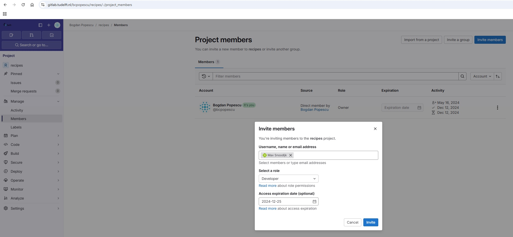
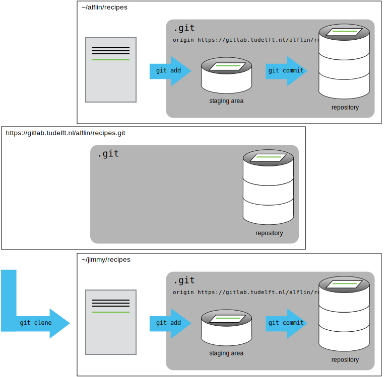
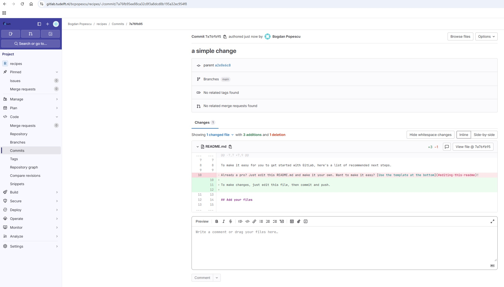
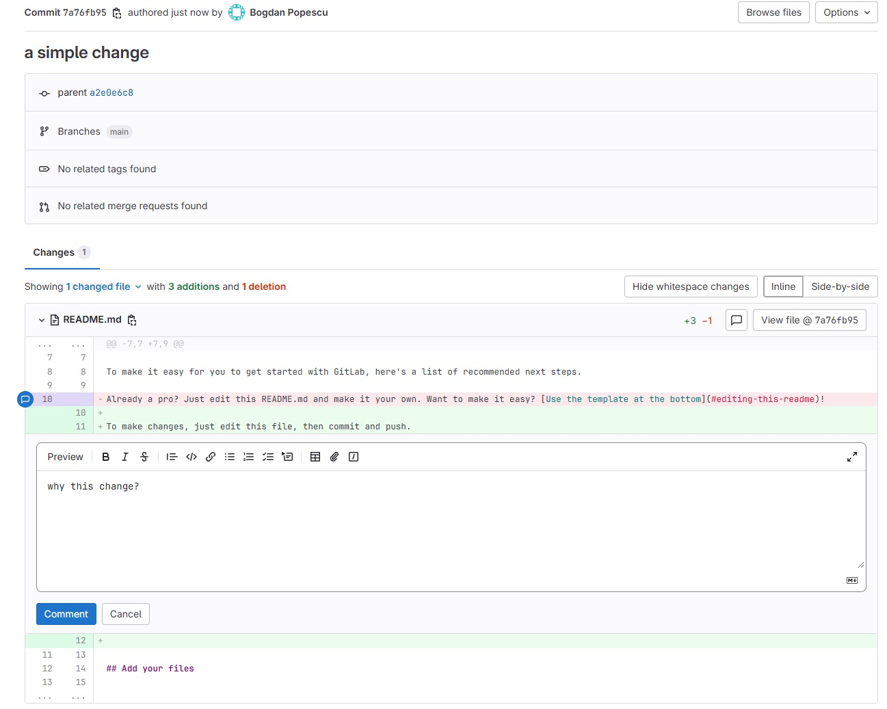
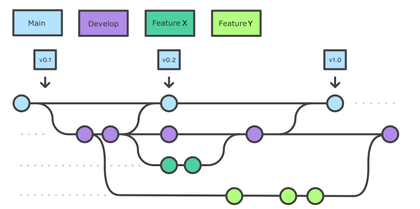
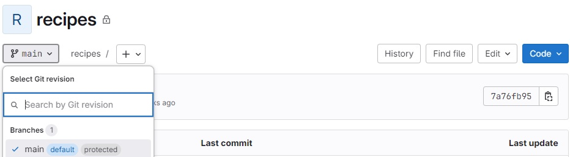
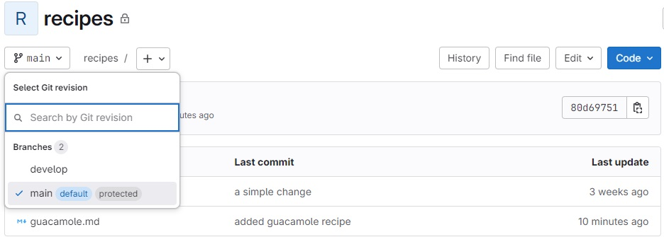
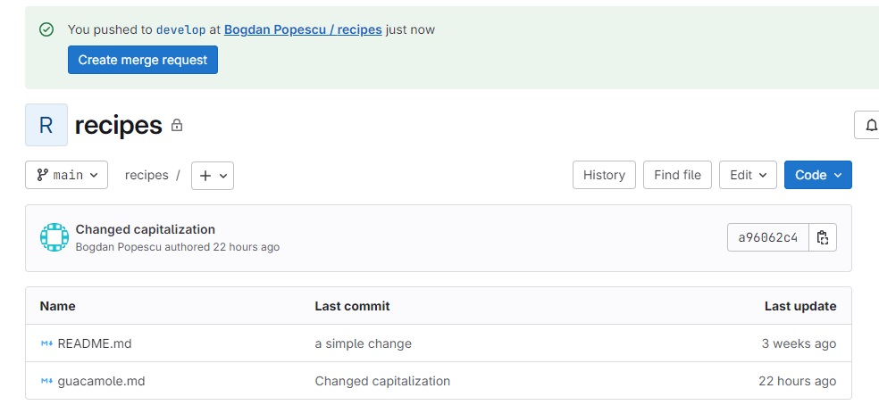
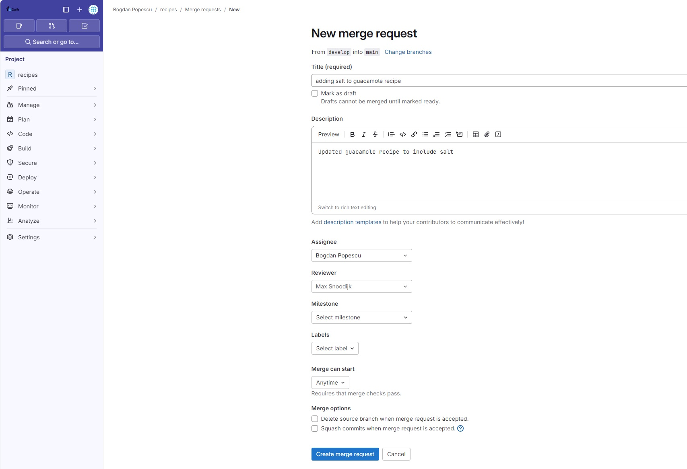

:::::::::::::::::::::::::::::::::::::: questions 

- How can I use version control to collaborate with other people?
- What do I do when my changes conflict with someone else's?

::::::::::::::::::::::::::::::::::::::::::::::::

::::::::::::::::::::::::::::::::::::: objectives

- Clone a remote repository.
- Collaborate by pushing to a common repository.
- Describe the basic collaborative workflow.
- Explain what conflicts are and when they can occur.
- Resolve conflicts resulting from a merge.

::::::::::::::::::::::::::::::::::::::::::::::::

## Collaborating

For the next step, get into pairs.  One person will be the "Owner" and the other
will be the "Collaborator". The goal is that the Collaborator add changes into
the Owner's repository. We will switch roles at the end, so both persons will
play Owner and Collaborator.

:::::::::::::::::::::::::::::::::::::::::  callout

#### Practicing By Yourself

If you're working through this lesson on your own, you can carry on by opening
a second terminal window.
This window will represent your partner, working on another computer. You
won't need to give anyone access on GitLab, because both 'partners' are you.


::::::::::::::::::::::::::::::::::::::::::::::::::

### Adding collaborators to your GitLab repo

The Owner needs to give the Collaborator access. In your project page on GitLab, click the "Manage"
menu on the left panel, then select the "Members" option. On the new "Project members" page
(see screenshot below), click on the "Invite members" button, and then fill in the
Collaborator's details as shown below.

{alt='Adding a new member to your GitLab project'}

Once the Collaborator has been added to the project, they will receive an email
instructing them how to accept the invitation and access the project

### Cloning a remote GitLab repo

Next, the Collaborator needs to download a copy of the Owner's repository to her
machine. This is called "cloning a repo".

The Collaborator doesn't want to overwrite her own version of `recipes.git`, so
needs to clone the Owner's repository to a different location than her own
repository with the same name.

To clone the Owner's repo into her `projects` folder, the Collaborator enters:

```bash
$ git clone git@gitlab.tudelft.nl:alflin/recipes.git ~/projects/alflin-recipes
```

Replace 'alflin' with the Owner's username.

If you choose to clone without the clone path
(`~/projects/alflin-recipes`) specified at the end,
you will clone inside your own recipes folder!
Make sure to navigate to the `projects` folder first.

{alt='A diagram showing that "git clone" can create a copy of a remote GitLab repository, allowing a second person to create their own local repository that they can make changes to.'}

### Making changes

The Collaborator can now make a change in her clone of the Owner's repository,
exactly the same way as we've been doing before:

```bash
$ cd ~/projects/alflin-recipes
$ nano hummus.md
$ cat hummus.md
```

```output
# Hummus
## Ingredients
* chickpeas
* lemon
* olive oil
* salt
```

```bash
$ git add hummus.md
$ git commit -m "Add ingredients for hummus"
```

```output
 1 file changed, 6 insertion(+)
 create mode 100644 hummus.md
```

Then push the change to the *Owner's repository* on GitLab:

```bash
$ git push origin main
```

```output
Enumerating objects: 4, done.
Counting objects: 4, done.
Delta compression using up to 4 threads.
Compressing objects: 100% (2/2), done.
Writing objects: 100% (3/3), 306 bytes, done.
Total 3 (delta 0), reused 0 (delta 0)
To gitlab.tudelft.nl:alflin/recipes.git
   9272da5..29aba7c  main -> main
```

Note that we didn't have to create a remote called `origin`: Git uses this
name by default when we clone a repository.  (This is why `origin` was a
sensible choice earlier when we were setting up remotes by hand.)

Take a look at the Owner's repository on GitLab again, and you should be
able to see the new commit made by the Collaborator. You may need to refresh
your browser to see the new commit.

:::::::::::::::::::::::::::::::::::::::::  callout

## Some more about remotes

In this episode and the previous one, our local repository has had
a single "remote", called `origin`. A remote is a copy of the repository
that is hosted somewhere else, that we can push to and pull from, and
there's no reason that you have to work with only one. For example,
on some large projects you might have your own copy in your own GitLab
account (you'd probably call this `origin`) and also the main "upstream"
project repository (let's call this `upstream` for the sake of examples).
You would pull from `upstream` from time to
time to get the latest updates that other people have committed.

Remember that the name you give to a remote only exists locally. It's
an alias that you choose - whether `origin`, or `upstream`, or `alfred` -
and not something intrinsic to the remote repository.

The `git remote` family of commands is used to set up and alter the remotes
associated with a repository. Here are some of the most useful ones:

- `git remote -v` lists all the remotes that are configured (we already used
  this in the last episode)
- `git remote add [name] [url]` is used to add a new remote
- `git remote remove [name]` removes a remote. Note that it doesn't affect the
  remote repository at all - it just removes the link to it from the local repo.
- `git remote set-url [name] [newurl]` changes the URL that is associated
  with the remote. This is useful if it has moved, e.g. to a different GitLab
  account, or from GitLab to a different hosting service. Or, if we made a typo when
  adding it!
- `git remote rename [oldname] [newname]` changes the local alias by which a remote
  is known - its name. For example, one could use this to change `upstream` to `alfred`.


::::::::::::::::::::::::::::::::::::::::::::::::::

### Sync-ing changes made by collaborators

To download the Collaborator's changes from GitLab, the Owner now enters:

```bash
$ git pull origin main
```

```output
remote: Enumerating objects: 4, done.
remote: Counting objects: 100% (4/4), done.
remote: Compressing objects: 100% (2/2), done.
remote: Total 3 (delta 0), reused 3 (delta 0), pack-reused 0
Unpacking objects: 100% (3/3), done.
From gitlab.tudelft.nl:alflin/recipes
 * branch            main     -> FETCH_HEAD
   9272da5..29aba7c  main     -> origin/main
Updating 9272da5..29aba7c
Fast-forward
 hummus.md | 5 +
 1 file changed, 5 insertion(+)
 create mode 100644 hummus.md
```

Now the three repositories (Owner's local, Collaborator's local, and Owner's on
GitLab) are back in sync.

:::::::::::::::::::::::::::::::::::::::::  callout

## A Basic Collaborative Workflow

In practice, it is good to be sure that you have an updated version of the
repository you are collaborating on, so you should `git pull` before making
our changes. The basic collaborative workflow would be:

- update your local repo with `git pull origin main`,
- make your changes and stage them with `git add`,
- commit your changes with `git commit -m`, and
- upload the changes to GitLab with `git push origin main`

It is better to make many commits with smaller changes rather than
of one commit with massive changes: small commits are easier to
read and review.


::::::::::::::::::::::::::::::::::::::::::::::::::

:::::::::::::::::::::::::::::::::::::::  challenge

### Switch Roles and Repeat

Switch roles and repeat the whole process.


::::::::::::::::::::::::::::::::::::::::::::::::::

:::::::::::::::::::::::::::::::::::::::  challenge

### Review Changes

The Owner pushed commits to the repository without giving any information
to the Collaborator. How can the Collaborator find out what has changed with
command line? And on GitLab?

:::::::::::::::  solution

### Solution

On the command line, the Collaborator can use `git fetch origin main`
to get the remote changes into the local repository, but without merging
them. Then by running `git diff main origin/main` the Collaborator
will see the changes output in the terminal.

On GitLab, the Collaborator can go to the project and click on the "Code" menu
on the left panel, and from there select the "Commits" option.
This will open a new page on the right panel, showing the commits history
for that project. By clicking on such a commit, the user can see the
changes made per file, which will be highlighted by GitLab as shown below.

{alt='Reviewing commit changes in GitLab'}


:::::::::::::::::::::::::

::::::::::::::::::::::::::::::::::::::::::::::::::

:::::::::::::::::::::::::::::::::::::::  challenge

### Comment Changes in GitLab

The Collaborator has some questions about one line change made by the Owner and
has some suggestions to propose.

With GitLab, it is possible to comment on a commit. Over the line of
code to comment, a blue comment icon appears to open a comment window.
In that window, the Collaborator can post their comments. When a comment
is posted, GitLab will inform the author of the commit about it by email,
and then the author can address the comment using the same GitLab web interface.

{alt='Commenting on commit changes in GitLab'}


::::::::::::::::::::::::::::::::::::::::::::::::::

:::::::::::::::::::::::::::::::::::::::  challenge

## Version History, Backup, and Version Control

Some backup software can keep a history of the versions of your files. They also
allows you to recover specific versions. How is this functionality different from version control?
What are some of the benefits of using version control, Git and GitLab?


::::::::::::::::::::::::::::::::::::::::::::::::::

## Solving Conflicts

As soon as people can work in parallel, they'll likely step on each other's
toes.  This will even happen with a single person: if we are working on
a piece of software on both our laptop and a server in the lab, we could make
different changes to each copy.  Version control helps us manage these
[conflicts](../learners/reference.md#conflict) by giving us tools to
[resolve](../learners/reference.md#resolve) overlapping changes.

To see how we can resolve conflicts, we must first create one.  The file
`guacamole.md` currently looks like this in both partners' copies of our `recipes`
repository:

```bash
$ cat guacamole.md
```

```output
# Guacamole
## Ingredients
* avocado
* lime
* salt
## Instructions
```

Let's add a line to the collaborator's copy only:

```bash
$ nano guacamole.md
$ cat guacamole.md
```

```output
# Guacamole
## Ingredients
* avocado
* lime
* salt
## Instructions
* put one avocado into a bowl.
```

and then push the change to GitLab:

```bash
$ git add guacamole.md
$ git commit -m "First step on the instructions"
```

```output
[main 5ae9631] First step on the instructions
 1 file changed, 1 insertion(+)
```

```bash
$ git push origin main
```

```output
Enumerating objects: 5, done.
Counting objects: 100% (5/5), done.
Delta compression using up to 8 threads
Compressing objects: 100% (3/3), done.
Writing objects: 100% (3/3), 331 bytes | 331.00 KiB/s, done.
Total 3 (delta 2), reused 0 (delta 0)
remote: Resolving deltas: 100% (2/2), completed with 2 local objects.
To gitlab.tudelft.nl:alflin/recipes.git
   29aba7c..dabb4c8  main -> main
```

Now let's have the owner make a different change to their copy *without* updating from GitLab:

```bash
$ nano guacamole.md
$ cat guacamole.md
```

```output
# Guacamole
## Ingredients
* avocado
* lime
* salt
## Instructions
* peel the avocados
```

We can commit the change locally:

```bash
$ git add guacamole.md
$ git commit -m "Add first step"
```

```output
[main 07ebc69] Add first step
 1 file changed, 1 insertion(+)
```

but Git won't let us push it to GitLab:

```bash
$ git push origin main
```

```output
To https://gitlab.tudelft.nl/alflin/recipes.git
 ! [rejected]        main -> main (fetch first)
error: failed to push some refs to 'https://gitlab.tudelft.nl:alflin/recipes.git'
hint: Updates were rejected because the remote contains work that you do
hint: not have locally. This is usually caused by another repository pushing
hint: to the same ref. You may want to first integrate the remote changes
hint: (e.g., 'git pull ...') before pushing again.
hint: See the 'Note about fast-forwards' in 'git push --help' for details.
```

{alt='A diagram showing a conflict that might occur when two sets of independent changes are merged'}


:::::::::::::::::::::::::::::::::::::::::  callout

### Telling Git how to solve conflicts

If you see the below in your output, Git is asking what it should do.

```output
hint: You have divergent branches and need to specify how to reconcile them.
hint: You can do so by running one of the following commands sometime before
hint: your next pull:
hint:
hint:   git config pull.rebase false  # merge (the default strategy)
hint:   git config pull.rebase true   # rebase
hint:   git config pull.ff only       # fast-forward only
hint:
hint: You can replace "git config" with "git config --global" to set a default
hint: preference for all repositories. You can also pass --rebase, --no-rebase,
hint: or --ff-only on the command line to override the configured default per
hint: invocation.
```

In newer versions of Git it gives you the option of specifying different
behaviours when a pull would merge divergent branches. In our case we want
'the default strategy'. To use this strategy run the following command to
select it as the default thing git should do.

```bash
$ git config pull.rebase false
```

Then attempt the pull again.

```bash
$ git pull origin main
```

::::::::::::::::::::::::::::::::::::::::::::::::::

The `git pull` command updates the local repository to include those
changes already included in the remote repository.
After the changes from remote branch have been fetched, Git detects that changes made to the local copy
overlap with those made to the remote repository, and therefore refuses to merge the two versions to
stop us from trampling on our previous work. The conflict is marked in
in the affected file:

```bash
$ cat guacamole.md
```

```output
# Guacamole
## Ingredients
* avocado
* lime
* salt
## Instructions
<<<<<<< HEAD
* peel the avocados
=======
* put one avocado into a bowl.
>>>>>>> dabb4c8c450e8475aee9b14b4383acc99f42af1d
```

Our change is preceded by `<<<<<<< HEAD`.
Git has then inserted `=======` as a separator between the conflicting changes
and marked the end of the content downloaded from GitLab with `>>>>>>>`.
(The string of letters and digits after that marker
identifies the commit we've just downloaded.)

It is now up to us to edit this file to remove these markers
and reconcile the changes.
We can do anything we want: keep the change made in the local repository, keep
the change made in the remote repository, write something new to replace both,
or get rid of the change entirely.
Let's replace both so that the file looks like this:

```bash
$ cat guacamole.md
```

```output
# Guacamole
## Ingredients
* avocado
* lime
* salt
## Instructions
* peel the avocados and put them into a bowl.
```

To finish merging,
we add `guacamole.md` to the changes being made by the merge
and then commit:

```bash
$ git add guacamole.md
$ git status
```

```output
On branch main
All conflicts fixed but you are still merging.
  (use "git commit" to conclude merge)

Changes to be committed:

	modified:   guacamole.md

```

```bash
$ git commit -m "Merge changes from GitLab"
```

```output
[main 2abf2b1] Merge changes from GitLab
```

Now we can push our changes to GitLab:

```bash
$ git push origin main
```

```output
Enumerating objects: 10, done.
Counting objects: 100% (10/10), done.
Delta compression using up to 8 threads
Compressing objects: 100% (6/6), done.
Writing objects: 100% (6/6), 645 bytes | 645.00 KiB/s, done.
Total 6 (delta 4), reused 0 (delta 0)
remote: Resolving deltas: 100% (4/4), completed with 2 local objects.
To https://gitlab.tudelft.nl:alflin/recipes.git
   dabb4c8..2abf2b1  main -> main
```

Git keeps track of what we've merged with what,
so we don't have to fix things by hand again
when the collaborator who made the first change pulls again:

```bash
$ git pull origin main
```

```output
remote: Enumerating objects: 10, done.
remote: Counting objects: 100% (10/10), done.
remote: Compressing objects: 100% (2/2), done.
remote: Total 6 (delta 4), reused 6 (delta 4), pack-reused 0
Unpacking objects: 100% (6/6), done.
From https://gitlab.tudelft.nl:alflin/recipes.git
 * branch            main     -> FETCH_HEAD
    dabb4c8..2abf2b1  main     -> origin/main
Updating dabb4c8..2abf2b1
Fast-forward
 guacamole.md | 2 +-
 1 file changed, 1 insertion(+), 1 deletion(-)
```

We get the merged file:

```bash
$ cat guacamole.md
```

```output
# Guacamole
## Ingredients
* avocado
* lime
* salt
## Instructions
* peel the avocados and put them into a bowl.
```

We don't need to merge again because Git knows someone has already done that.

### How to minimize the chance of conflicts

Git's ability to resolve conflicts is very useful, but conflict resolution
costs time and effort, and can introduce errors if conflicts are not resolved
correctly. If you find yourself resolving a lot of conflicts in a project,
consider these technical approaches to reducing them:

- Pull from upstream more frequently, especially before starting new work
- Use topic branches to segregate work, merging to main when complete
- Make smaller more atomic commits
- Push your work when it is done and encourage your team to do the same to reduce work in progress and, by extension, the chance of having conflicts
- Where logically appropriate, break large files into smaller ones so that it is
  less likely that two authors will alter the same file simultaneously

Conflicts can also be minimized with project management strategies:

- Clarify who is responsible for what areas with your collaborators
- Discuss what order tasks should be carried out in with your collaborators so
  that tasks expected to change the same lines won't be worked on simultaneously
- If the conflicts are stylistic churn (e.g. tabs vs. spaces), establish a
  project convention that is governing and use code style tools (e.g.
  `htmltidy`, `perltidy`, `rubocop`, etc.) to enforce, if necessary

:::::::::::::::::::::::::::::::::::::::  challenge

## Solving Conflicts that You Create

Clone the repository created by your instructor.
Add a new file to it,
and modify an existing file (your instructor will tell you which one).
When asked by your instructor,
pull her changes from the repository to create a conflict,
then resolve it.


::::::::::::::::::::::::::::::::::::::::::::::::::

:::::::::::::::::::::::::::::::::::::::  challenge

## Conflicts on Non-textual files

What does Git do
when there is a conflict in an image or some other non-textual file
that is stored in version control?

:::::::::::::::  solution

## Solution

Let's try it. Suppose Alfredo takes a picture of its guacamole and
calls it `guacamole.jpg`.

If you do not have an image file of guacamole available, you can create
a dummy binary file like this:

```bash
$ head --bytes 1024 /dev/urandom > guacamole.jpg
$ ls -lh guacamole.jpg
```

```output
-rw-r--r-- 1 alflin 57095 1.0K Mar  8 20:24 guacamole.jpg
```

`ls` shows us that this created a 1-kilobyte file. It is full of
random bytes read from the special file, `/dev/urandom`.

Now, suppose Alfredo adds `guacamole.jpg` to his repository:

```bash
$ git add guacamole.jpg
$ git commit -m "Add picture of guacamole"
```

```output
[main 8e4115c] Add picture of guacamole
 1 file changed, 0 insertions(+), 0 deletions(-)
 create mode 100644 guacamole.jpg
```

Suppose that Jimmy has added a similar picture in the meantime.
His is a picture of a guacamole with nachos, but it is *also* called `guacamole.jpg`.
When Alfredo tries to push, he gets a familiar message:

```bash
$ git push origin main
```

```output
To https://gitlab.tudelft.nl/alflin/recipes.git
 ! [rejected]        main -> main (fetch first)
error: failed to push some refs to 'https://gitlab.tudelft.nl:alflin/recipes.git'
hint: Updates were rejected because the remote contains work that you do
hint: not have locally. This is usually caused by another repository pushing
hint: to the same ref. You may want to first integrate the remote changes
hint: (e.g., 'git pull ...') before pushing again.
hint: See the 'Note about fast-forwards' in 'git push --help' for details.
```

We've learned that we must pull first and resolve any conflicts:

```bash
$ git pull origin main
```

When there is a conflict on an image or other binary file, git prints
a message like this:

```output
$ git pull origin main
remote: Counting objects: 3, done.
remote: Compressing objects: 100% (3/3), done.
remote: Total 3 (delta 0), reused 0 (delta 0)
Unpacking objects: 100% (3/3), done.
From https://gitlab.tudelft.nl:alflin/recipes.git
 * branch            main     -> FETCH_HEAD
   6a67967..439dc8c  main     -> origin/main
warning: Cannot merge binary files: guacamole.jpg (HEAD vs. 439dc8c08869c342438f6dc4a2b615b05b93c76e)
Auto-merging guacamole.jpg
CONFLICT (add/add): Merge conflict in guacamole.jpg
Automatic merge failed; fix conflicts and then commit the result.
```

The conflict message here is mostly the same as it was for `guacamole.md`, but
there is one key additional line:

```output
warning: Cannot merge binary files: guacamole.jpg (HEAD vs. 439dc8c08869c342438f6dc4a2b615b05b93c76e)
```

Git cannot automatically insert conflict markers into an image as it does
for text files. So, instead of editing the image file, we must check out
the version we want to keep. Then we can add and commit this version.

On the key line above, Git has conveniently given us commit identifiers
for the two versions of `guacamole.jpg`. Our version is `HEAD`, and Jimmy's
version is `439dc8c0...`. If we want to use our version, we can use
`git checkout`:

```bash
$ git checkout HEAD guacamole.jpg
$ git add guacamole.jpg
$ git commit -m "Use image of just guacamole instead of with nachos"
```

```output
[main 21032c3] Use image of just guacamole instead of with nachos
```

If instead we want to use Jimmy's version, we can use `git checkout` with
Jimmy's commit identifier, `439dc8c0`:

```bash
$ git checkout 439dc8c0 guacamole.jpg
$ git add guacamole.jpg
$ git commit -m "Use image of guacamole with nachos instead of just guacamole"
```

```output
[main da21b34] Use image of guacamole with nachos instead of just guacamole
```

We can also keep *both* images. The catch is that we cannot keep them
under the same name. But, we can check out each version in succession
and *rename* it, then add the renamed versions. First, check out each
image and rename it:

```bash
$ git checkout HEAD guacamole.jpg
$ git mv guacamole.jpg guacamole-only.jpg
$ git checkout 439dc8c0 guacamole.jpg
$ mv guacamole.jpg guacamole-nachos.jpg
```

Then, remove the old `guacamole.jpg` and add the two new files:

```bash
$ git rm guacamole.jpg
$ git add guacamole-only.jpg
$ git add guacamole-nachos.jpg
$ git commit -m "Use two images: just guacamole and with nachos"
```

```output
[main 94ae08c] Use two images: just guacamole and with nachos
 2 files changed, 0 insertions(+), 0 deletions(-)
 create mode 100644 guacamole-nachos.jpg
 rename guacamole.jpg => guacamole-only.jpg (100%)
```

Now both images of guacamole are checked into the repository, and `guacamole.jpg`
no longer exists.


:::::::::::::::::::::::::

::::::::::::::::::::::::::::::::::::::::::::::::::

:::::::::::::::::::::::::::::::::::::::  challenge

### A Typical Work Session

You sit down at your computer to work on a shared project that is tracked in a
remote Git repository. During your work session, you take the following
actions, but not in this order:

- *Make changes* by appending the number `100` to a text file `numbers.txt`
- *Update remote* repository to match the local repository
- *Celebrate* your success with some fancy beverage(s)
- *Update local* repository to match the remote repository
- *Stage changes* to be committed
- *Commit changes* to the local repository

In what order should you perform these actions to minimize the chances of
conflicts? Put the commands above in order in the *action* column of the table
below. When you have the order right, see if you can write the corresponding
commands in the *command* column. A few steps are populated to get you
started.

| order | action . . . . . . . . . . | command . . . . . . . . . .                   |
| ----- | -------------------------- | --------------------------------------------- |
| 1     |                            |                                               |
| 2     |                            | `echo 100 >> numbers.txt`                     |
| 3     |                            |                                               |
| 4     |                            |                                               |
| 5     |                            |                                               |
| 6     | Celebrate!                 |                                               |

:::::::::::::::  solution

### Solution

| order | action . . . . . .         | command . . . . . . . . . . . . . . . . . . . |
| ----- | -------------------------- | --------------------------------------------- |
| 1     | Update local               | `git pull origin main`                        |
| 2     | Make changes               | `echo 100 >> numbers.txt`                     |
| 3     | Stage changes              | `git add numbers.txt`                         |
| 4     | Commit changes             | `git commit -m "Add 100 to numbers.txt"`      |
| 5     | Update remote              | `git push origin main`                        |
| 6     | Celebrate!                 |                                               |

:::::::::::::::::::::::::

::::::::::::::::::::::::::::::::::::::::::::::::::

## Git Branches

When we do `git status`,
Git also tells us that we are currently on the `main` branch of the project.
A branch is one version of your project (the files in your repository) that can contain its own set of commits.
We can create a new branch, make changes to the code which we then commit to the branch,
and, once we are happy with those changes, merge them back to the main branch.
To see what other branches are available, do:

```bash
$ git branch
```

```output
* main
```

At the moment, there is only one branch (`main`) and hence only one version of the code available.
When you create a Git repository for the first time, by default you only get one version (i.e. branch) - `main`.
Let us have a look at why having different branches might be useful.

&nbsp;

### Feature Branch Software Development Workflow

While it is technically OK to commit your changes directly to `main` branch,
and you may often find yourself doing so for some minor changes,
the best practice is to use a new branch for each separate and self-contained unit/piece of work
you want to add to the project. This unit of work is also often called a *feature*
and the branch where you develop it is called a *feature branch*.
Each feature branch should have its own meaningful name - indicating its purpose (e.g. "issue23-fix").
If we keep making changes and pushing them directly to `main` branch on GitLab, then anyone who downloads our software
from there will get all of our work in progress - whether or not it is ready to use!
So, working on a separate branch for each feature you are adding is good for several reasons:

- it enables the main branch to remain stable while you and the team explore and test the new code on a feature branch,
- it enables you to keep the untested and not-yet-functional feature branch code under version control and backed up,
- you and other team members may work on several features at the same time independently from one another, and
- if you decide that the feature is not working or is no longer needed -
  you can easily and safely discard that branch without affecting the rest of the code.

Branches are commonly used as part of a feature-branch workflow, shown in the diagram below.

{alt='Git feature branch workflow diagram' .image-with-shadow width="800px"}

<p style="text-align: center;">Git feature branches<br>
Adapted from <a href="https://sillevl.gitbooks.io/git/content/collaboration/workflows/gitflow/" target="_blank">Git Tutorial by sillevl</a> (Creative Commons Attribution 4.0 International License)</p>

In the software development workflow, we typically have a main branch which is the version of the code that is
tested, stable and reliable. Then, we normally have a development branch (called `develop` or `dev` by convention)
that we use for work-in-progress code. As we work on adding new features to the code, we create new feature branches
that first get merged into `develop` after a thorough testing process. After even more testing - `develop` branch will
get merged into `main`. The points when feature branches are merged to `develop`,
and `develop` to `main` depend entirely on the practice/strategy established in the team.
For example, for smaller projects (e.g. if you are working alone on a project or in a very small team),
feature branches sometimes get directly merged into `main` upon testing, skipping the `develop` branch step.
In other projects, the merge into `main` happens only at the point of making a new software release.
Whichever is the case for you, a good rule of thumb is - **nothing that is broken should be in `main`**.

&nbsp;

### Creating Branches

Let us create a `develop` branch to work on:

```bash
$ git branch develop
```

This command does not give any output, but if we run `git branch` again, without giving it a new branch name, we can
see the list of branches we have - including the new one we have just made.

```bash
$ git branch
```

```output
    develop
  * main
```

The `*` indicates the currently active branch. So how do we switch to our new branch?
We use the `git switch` command with the name of the branch:

```bash
$ git switch develop
```

```output
Switched to branch 'develop'
```

:::::::::::::::::::::::::::::::::::::::::  callout

##### Create and Switch to Branch Shortcut

A shortcut to create a new branch and immediately switch to it:

```bash
$ git switch -c develop
```

::::::::::::::::::::::::::::::::::::::::::::::::::

&nbsp;

### Updating Branches

If we start updating and committing files now, the commits will happen on the `develop` branch and will not affect the
version of the code in `main`. We add and commit things to `develop` branch in the same way as we do to `main`.

Let us make a small modification to `guacamole.md` and, say, change *"peel the avocados"* to *"Peel the avocados"*
to see updating branches in action.

If we do:

```bash
$ git status
```

```output
   On branch develop
   Changes not staged for commit:
     (use "git add <file>..." to update what will be committed)
     (use "git restore <file>..." to discard changes in working directory)

   	modified:   guacamole.md

   no changes added to commit (use "git add" and/or "git commit -a")
```

Git is telling us that we are on branch `develop` and which tracked files have been modified in our working directory.

We can now `add` and `commit` the changes in the usual way.

```bash
$ git add guacamole.md
$ git commit -m "Capitalization fix"
```

:::::::::::::::::::::::::::::::::::::::::  callout

##### Currently Active Branch

Remember, `add` and `commit` commands always act on the currently active branch.
You have to be careful and aware of which branch you are working with at any given moment.
`git status` can help with that, and you will find yourself invoking it very often.


::::::::::::::::::::::::::::::::::::::::::::::::::


&nbsp;

### Pushing New Branch Remotely

We push the contents of the `develop` branch to GitLab in the same way as we pushed the `main` branch.
However, as we have just created this branch locally, it still does not exist in our remote repository.
You can check that in GitLab by listing all branches.

{alt="Software project's main branch" .image-with-shadow width="600px"}

To push a new local branch remotely for the first time, you could use the `-u` flag and the name of the branch you are
creating and pushing to:

```bash
$ git push -u origin develop
```

:::::::::::::::::::::::::::::::::::::::::  callout

##### Git Push With `-u` Flag

Using the `-u` switch with the `git push` command is a handy shortcut for:
(1) creating the new remote branch and
(2) setting your local branch to automatically track the remote one at the same time. You need to use the `-u` switch
only once to set up that association between your branch and the remote one explicitly. After that you could simply
use `git push` without specifying the remote repository, if you wished so.
We still prefer to explicitly state this information in commands.


::::::::::::::::::::::::::::::::::::::::::::::::::

Let us confirm that the new branch `develop` now exist remotely on GitLab too. From your repository main page
in GitLab, click the branch dropdown menu (currently showing the default branch `main`). You should see your `develop`
branch in the list too.

{alt="Software project's develop branch" .image-with-shadow width="600px"}

You may also have noticed GitLab's notification about the latest push to your `develop` branch just
on top of the repository files and branches drop-down menu.

Now the others can check out the `develop` branch too and continue to develop code on it.

After the initial push of the new branch, each next time we push to it in the usual manner (i.e. without the `-u` switch):

```bash
$ git push origin develop
```

:::::::::::::::::::::::::::::::::::::::::  callout

##### What is the Relationship Between Originating and New Branches?

It is natural to think that new branches have a parent/child relationship with their originating branch, but in actual
Git terms, branches themselves do not have parents but single commits do. Any commit can have zero parents
(a root, or initial, commit), one parent (a regular commit), or multiple parents (a merge commit),
and using this structure, we can build a 'view' of branches from a set of commits and their relationships.
A common way to look at it is that Git branches are really only
[lightweight, movable pointers to commits](https://git-scm.com/book/en/v2/Git-Branching-Branches-in-a-Nutshell).
So as a new commit is added to a branch, the branch pointer is moved to the new commit.

What this means is that when you accomplish a merge between two branches, Git is able to determine the common
'commit ancestor' through the commits in a 'branch', and use that common ancestor to determine which commits need to be
merged onto the destination branch. It also means that, in theory, you could merge any branch with any other at any
time... although it may not make sense to do so!


::::::::::::::::::::::::::::::::::::::::::::::::::

&nbsp;

### Merging Into Main Branch

Once you have tested your changes on the `develop` branch, you will want to merge them onto the `main` branch.
To do so, make sure you have committed all your changes on the `develop` branch and then switch to `main`:

```bash
$ git switch main
```

```output
Switched to branch 'main'
Your branch is up to date with 'origin/main'.
```

To merge the `develop` branch on top of `main` do:

```bash
$ git merge develop
```

```output
Updating 80d6975..a96062c
Fast-forward
 guacamole.md | 2 +-
 1 file changed, 1 insertion(+), 1 deletion(-)
```

If there are no conflicts, Git will merge the branches without complaining and replay all commits from `develop` on top
of the last commit from `main`. If there are merge conflicts (e.g. a team collaborator modified the same portion of the
same file you are working on and checked in their changes before you), the particular files with conflicts will be marked
and you will need to resolve those conflicts and commit the changes before attempting to merge again.
Since we have no conflicts, we can now push the `main` branch to the remote repository:

```bash
$ git push origin main
```

:::::::::::::::::::::::::::::::::::::::::  callout

##### All Branches Are Equal

In Git, all branches are equal - there is nothing special about the `main` branch.
It is called that by convention and is created by default, but it can also be called something else.
A good example is `gh-pages` branch which is often the source branch for website projects hosted on GitHub
(rather than `main`).


::::::::::::::::::::::::::::::::::::::::::::::::::

:::::::::::::::::::::::::::::::::::::  testimonial

##### Keeping Main Branch Stable

Good software development practice is to keep the `main` branch stable while you and the team develop and test new
functionalities on feature branches (which can be done in parallel and independently by different team members).
The next step is to merge feature branches onto the `develop` branch, where more testing can occur to verify that the
new features work well with the rest of the code (and not just in isolation). We talk more about different types of
code testing in one of the following episodes.

::::::::::::::::::::::::::::::::::::::::::::::::::


&nbsp;

### Merge Requests in GitLab

In addition to merging branches through the command line, it is also possible to perform a *Merge Request* in GitLab.
To see how this works, switch back to the *develop* branch in the *recipes* repo, and modify the guacamole recipe -
by adding one extra line for the 'Instructions': 'Add salt'. Commit your changes, and push them to GitLab.

When you reload your GitLab repo main page, you should see that GitLab now gives you the option to create a
'Merge Request' to merge your changes in *develop* to *main*:

{alt="Merge Request button after pushing to a branch" .image-with-shadow width="600px"}

When clicking the "Create merge request" button, GitLab will open a new Merge Request form:

{alt="Merge Request form" .image-with-shadow width="600px"}

There you can fill details abut this merge, such as the Title and Description, as well as some process-related
fields, such as the Asignee and Reviewer. It is good practice to always have a reviewer for any significant code
changes. Many large software projects have strict governance rules requiring for example at least one reviewer approval
before merging to the *main* branch, and it is even possible to even configure GitLab to enforce such policies.
For now, we advise you to setup informal review rules with your colleagues when working on a joint project.

Once a merge request has been created, GitLab provides process controls for managing its lifecycle:

{alt="Merge Request Lifecycle" .image-with-shadow width="600px"}

This form can be accessed from the "Merge requests" menu on the left tab. On this form you can perform actions such as:
- approve the merge request by clicking the "Approve" button.
- do the actual (Git) merge by clicking the "Merge" button.
- review the commits part of this merge request in the "Commits" tab
- review the code changes part of this merge request in the "Changes" tab
- comment on code changes, also from the "Changes" tab. When making a comment, GitLab notifies the asignee for the
merge request about the comment via email.


&nbsp;
&nbsp;


::::::::::::::::::::::::::::::::::::: keypoints

- `git clone` copies a remote repository to create a local repository with a remote called `origin` automatically set up.
- Conflicts occur when two or more people change the same lines of the same file.
- The version control system does not allow people to overwrite each other's changes blindly, but highlights conflicts so that they can be resolved.
- A branch is one version of your project that can contain its own set of commits.
- Feature branches enable us to develop / explore / test new code features without affecting the stable `main` code.
- GitLab merge requests provide a structured process approach to Git branch merging

::::::::::::::::::::::::::::::::::::::::::::::::

&nbsp;
&nbsp;


## Hands-on Project

- Work in groups of two
- Create a GitLab project on the TUD GitLab server
- Assign project roles to each team member
- Create a shared (text) document representing a joint research paper.
- Each member works independently on different sections of the document in separate branches.
- Show how merging can be done without conflicts
- Start working on the same section creating a conflict
- show how it can be solved using GitLab merge requests and Git conflict resolution

&nbsp;
&nbsp;


