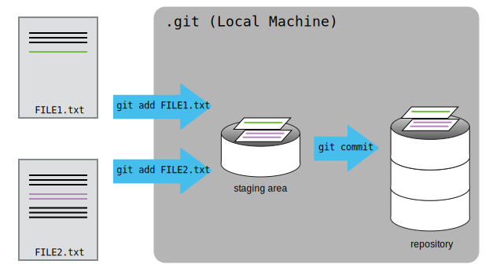
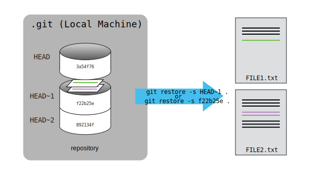
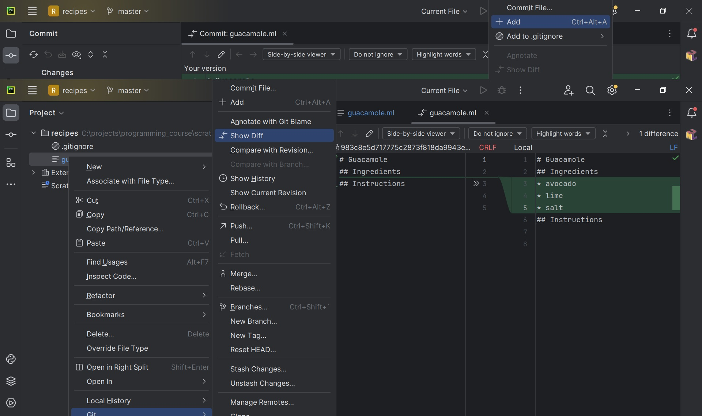
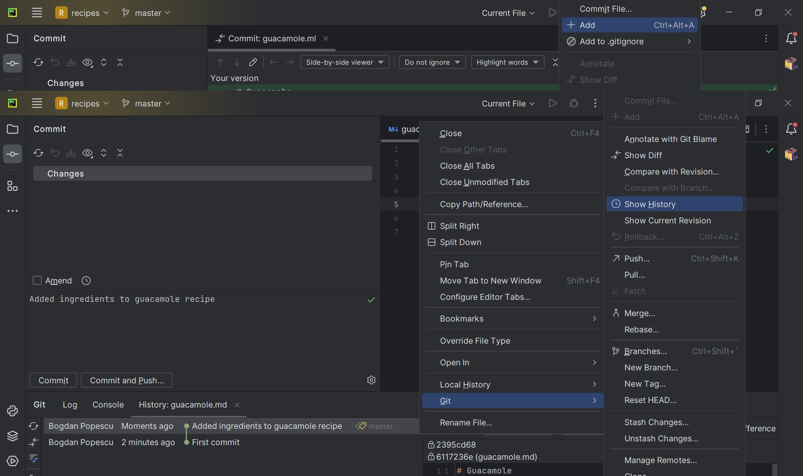
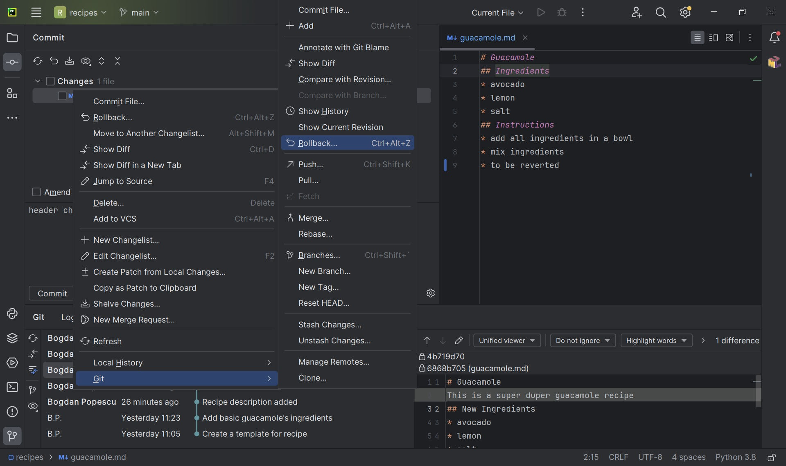
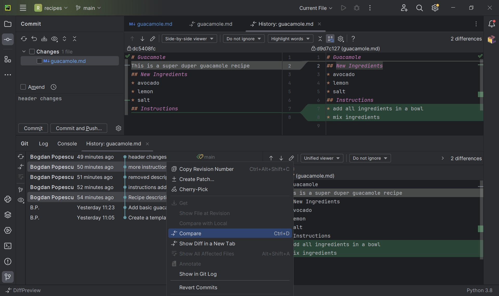

:::::::::::::::::::::::::::::::::::::: questions 

- How do I record changes in Git?
- How do I record notes about what changes I made and why?
- How can I identify old versions of files?
- How do I review my changes?
- How can I recover old versions of files?
- How can I tell Git to ignore files I don’t want to track?

::::::::::::::::::::::::::::::::::::::::::::::::

::::::::::::::::::::::::::::::::::::: objectives

- Go through the modify-add-commit cycle for one or more files.
- Explain where information is stored at each stage of that cycle.
- Distinguish between descriptive and non-descriptive commit messages.
- Explain what the HEAD of a repository is and how to use it.
- Compare various versions of tracked files.
- Restore old versions of files.
- Configure Git to ignore specific files.

::::::::::::::::::::::::::::::::::::::::::::::::

## The Modify-Add-Commit Cycle
In this episode we will continue working with the `recipes` repository you have created in the previous episode.
First let's make sure we're still in the right directory. You should be in the `recipes` directory.

```bash
$ cd ~/Desktop/recipes
```

Let's create a file called `guacamole.md` that contains the basic structure to have a recipe. We will use `nano` to edit
the file, but feel free to use another text editor if you prefer. In particular, this does not have to be the `core.editor`
you set globally earlier. But remember, the steps to create create or edit a new file will depend on the editor you
choose (it might not be nano).

```bash
$ nano guacamole.md
```

Type the text below into the `guacamole.md` file:

```output
# Guacamole
## Ingredients
## Instructions
```

Save the file and exit your editor. Next, let’s verify that the file was properly created by running the list command (`ls`):

```bash
$ ls
```

```output
guacamole.md
```

`guacamole.md` contains three lines, which we can see by running:

```bash
$ cat guacamole.md
```

```output
# Guacamole
## Ingredients
## Instructions
```

If we check the status of our project again, Git tells us that it's noticed the new file:

```bash
$ git status
```

```output
On branch main

No commits yet

Untracked files:
   (use "git add <file>..." to include in what will be committed)

	guacamole.md

nothing added to commit but untracked files present (use "git add" to track)
```

The "untracked files" message means that there's a file in the directory that Git isn't keeping track of.
We can tell Git to track a file using `git add`:

```bash
$ git add guacamole.md
```

and then check that the right thing happened:

```bash
$ git status
```

```output
On branch main

No commits yet

Changes to be committed:
  (use "git rm --cached <file>..." to unstage)

	new file:   guacamole.md

```

Git now knows that it's supposed to keep track of `guacamole.md`, but it hasn't recorded these changes as a commit yet.
To get it to do that, we need to run one more command:

```bash
$ git commit -m "Create a template for recipe"
```

```output
[main (root-commit) f22b25e] Create a template for recipe
 1 file changed, 1 insertion(+)
 create mode 100644 guacamole.md
```

When we run `git commit`, Git takes everything we have told it to save by using `git add` and stores a copy permanently
inside the special `.git` directory. This permanent copy is called a [commit](../learners/reference.md#commit)
(or [revision](../learners/reference.md#revision)) and its short identifier is `f22b25e`. Your commit may have another
identifier.

We use the `-m` flag (for "message") to record a short, descriptive, and specific comment that will help us remember
later on what we did and why. If we just run `git commit` without the `-m` option, Git will launch `nano` (or whatever
other editor we configured as `core.editor`) so that we can write a longer message.

[Good commit messages][commit-messages] start with a brief (\<50 characters) statement about the changes made in the
commit. Generally, the message should complete the sentence "If applied, this commit will" <commit message here>. If you
want to go into more detail, add a blank line between the summary line and your additional notes. Use this additional
space to explain why you made changes and/or what their impact will be.

If we run `git status` now:

```bash
$ git status
```

```output
On branch main
nothing to commit, working tree clean
```

it tells us everything is up to date. If we want to know what we've done recently, we can ask Git to show us the
project's history using `git log`:

```bash
$ git log
```

```output
commit f22b25e3233b4645dabd0d81e651fe074bd8e73b
Author: Alfredo Linguini <a.linguini@ratatouille.fr>
Date:   Thu Aug 22 09:51:46 2023 -0400

    Create a template for recipe
```

`git log` lists all commits  made to a repository in reverse chronological order. The listing for each commit includes
the commit's full identifier (which starts with the same characters as the short identifier printed by the `git commit`
command earlier), the commit's author, when it was created, and the log message Git was given when the commit was created.

:::::::::::::::::::::::::::::::::::::::::  callout

#### Where Are My Changes?

If we run `ls` at this point, we will still see just one file called `guacamole.md`. That's because Git saves
information about files' history in the special `.git` directory mentioned earlier so that our filesystem doesn't
become cluttered (and so that we can't accidentally edit or delete an old version).


::::::::::::::::::::::::::::::::::::::::::::::::::


### Modifying tracked files

Now suppose Alfredo adds more information to the file. (Again, we'll edit with `nano` and then `cat` the file to
show its contents; you may use a different editor, and don't need to `cat`.)

```bash
$ nano guacamole.md
$ cat guacamole.md
```

```output
# Guacamole
## Ingredients
* avocado
* lemon
* salt
## Instructions
```

When we run `git status` now, it tells us that a file it already knows about has been modified:

```bash
$ git status
```

```output
On branch main
Changes not staged for commit:
  (use "git add <file>..." to update what will be committed)
  (use "git restore <file>..." to discard changes in working directory)

	modified:   guacamole.md

no changes added to commit (use "git add" and/or "git commit -a")
```

The last line is the key phrase: "no changes added to commit". We have changed this file, but we haven't told Git we
will want to save those changes (which we do with `git add`) nor have we saved them (which we do with `git commit`).
So let's do that now. It is good practice to always review our changes before saving them. We do this using `git diff`.
This shows us the differences between the current state of the file and the most recently saved version:

```bash
$ git diff
```

```output
diff --git a/guacamole.md b/guacamole.md
index df0654a..315bf3a 100644
--- a/guacamole.md
+++ b/guacamole.md
@@ -1,3 +1,6 @@
 # Guacamole
 ## Ingredients
+* avocado
+* lemon
+* salt
 ## Instructions
```

The output is cryptic because it is actually a series of commands for tools like editors and `patch`
telling them how to reconstruct one file given the other. If we break it down into pieces:

1. The first line tells us that Git is producing output similar to the Unix `diff` command
  comparing the old and new versions of the file.
2. The second line tells exactly which versions of the file Git is comparing;
  `df0654a` and `315bf3a` are unique computer-generated labels for those versions.
3. The third and fourth lines once again show the name of the file being changed.
4. The remaining lines are the most interesting, they show us the actual differences
  and the lines on which they occur. In particular, the `+` marker in the first column shows where we added a line.

After reviewing our change, it's time to commit it:

```bash
$ git commit -m "Add basic guacamole's ingredients"
$ git status
```

```output
On branch main
Changes not staged for commit:
  (use "git add <file>..." to update what will be committed)
  (use "git restore <file>..." to discard changes in working directory)

	modified:   guacamole.md

no changes added to commit (use "git add" and/or "git commit -a")
```

Whoops: Git won't commit because we didn't use `git add` first. Let's fix that:

```bash
$ git add guacamole.md
$ git commit -m "Add basic guacamole's ingredients"
```

```output
[main 34961b1] Add basic guacamole's ingredient
 1 file changed, 3 insertions(+)
```

Git insists that we add files to the set we want to commit before actually committing anything. This allows us to commit
our changes in stages and capture changes in logical portions rather than only large batches. For example, suppose we're
adding a few citations to relevant research to our thesis. We might want to commit those additions, and the
corresponding bibliography entries, but *not* commit some of our work drafting the conclusion (which we haven't finished yet).

To allow for this, Git has a special *staging area* where it keeps track of things that have been added to
the current [changeset](../learners/reference.md#changeset) but not yet committed.

:::::::::::::::::::::::::::::::::::::::::  callout

##### Staging Area

If you think of Git as taking snapshots of changes over the life of a project, `git add` specifies *what* will go in
a snapshot (putting things in the staging area), and `git commit` then *actually takes* the snapshot, and
makes a permanent record of it (as a commit). If you don't have anything staged when you type `git commit`,
Git will prompt you to use `git commit -a` or `git commit --all`, which is kind of like gathering *everyone* to take a
group photo! However, it's almost always better to explicitly add things to the staging area, because you might
commit changes you forgot you made. (Going back to the group photo simile, you might get an extra with incomplete makeup
walking on the stage for the picture because you used `-a`!) Try to stage things manually, or you might find yourself
searching for "git undo commit" more than you would like!

::::::::::::::::::::::::::::::::::::::::::::::::::

{alt='A diagram showing how "git add" registers changes in the staging area, while "git commit" moves changes from the staging area to the repository'}

Let's watch as our changes to a file move from our editor to the staging area
and into long-term storage. First, we'll improve our recipe by changing 'lemon' to 'lime':

```bash
$ nano guacamole.md
$ cat guacamole.md
```

```output
# Guacamole
## Ingredients
* avocado
* lime
* salt
## Instructions
```

```bash
$ git diff
```

```output
diff --git a/guacamole.md b/guacamole.md
index 315bf3a..b36abfd 100644
--- a/guacamole.md
+++ b/guacamole.md
@@ -1,6 +1,6 @@
 # Guacamole
 ## Ingredients
 * avocado
-* lemon
+* lime
 * salt
 ## Instructions
```

So far, so good: we've replaced one line (shown with a `-` in the first column) with a new line (shown with a `+` in the
first column). Now let's put that change in the staging area and see what `git diff` reports:

```bash
$ git add guacamole.md
$ git diff
```

There is no output: as far as Git can tell, there's no difference between what it's been asked to save permanently
and what's currently in the directory. However, if we do this:

```bash
$ git diff --staged
```

```output
diff --git a/guacamole.md b/guacamole.md
index 315bf3a..b36abfd 100644
--- a/guacamole.md
+++ b/guacamole.md
@@ -1,6 +1,6 @@
 # Guacamole
 ## Ingredients
 * avocado
-* lemon
+* lime
 * salt
 ## Instructions
```

it shows us the difference between the last committed change and what's in the staging area. Let's save our changes:

```bash
$ git commit -m "Modify guacamole to the traditional recipe"
```

```output
[main 005937f] Modify guacamole to the traditional recipe
 1 file changed, 1 insertion(+)
```

check our status:

```bash
$ git status
```

```output
On branch main
nothing to commit, working tree clean
```

and look at the history of what we've done so far:

```bash
$ git log
```

```output
commit 005937fbe2a98fb83f0ade869025dc2636b4dad5 (HEAD -> main)
Author: Alfredo Linguini <a.linguini@ratatouille.fr>
Date:   Thu Aug 22 10:14:07 2023 -0400

    Modify guacamole to the traditional recipe

commit 34961b159c27df3b475cfe4415d94a6d1fcd064d
Author: Alfredo Linguini <a.linguini@ratatouille.fr>
Date:   Thu Aug 22 10:07:21 2023 -0400

    Add basic guacamole's ingredients

commit f22b25e3233b4645dabd0d81e651fe074bd8e73b
Author: Alfredo Linguini <a.linguini@ratatouille.fr>
Date:   Thu Aug 22 09:51:46 2023 -0400

    Create a template for recipe
```

:::::::::::::::::::::::::::::::::::::::::  callout

##### Word-based diffing

Sometimes, e.g. in the case of the text documents a line-wise diff is too coarse. That is where the `--color-words`
option of `git diff` comes in very useful as it highlights the changed words using colors.


::::::::::::::::::::::::::::::::::::::::::::::::::

:::::::::::::::::::::::::::::::::::::::::  callout

##### Paging the Log

When the output of `git log` is too long to fit in your screen, `git` uses a program to split it into pages of the size
of your screen. When this "pager" is called, you will notice that the last line in your screen is a `:`, instead of your usual prompt.

- To get out of the pager, press <kbd>Q</kbd>.
- To move to the next page, press <kbd>Spacebar</kbd>.
- To search for `some_word` in all pages,
  press <kbd>/</kbd>
  and type `some_word`.
  Navigate through matches pressing <kbd>N</kbd>.


::::::::::::::::::::::::::::::::::::::::::::::::::

:::::::::::::::::::::::::::::::::::::::::  callout

#### Limit Log Size

To avoid having `git log` cover your entire terminal screen, you can limit the number of commits that Git lists by using
`-N`, where `N` is the number of commits that you want to view. For example, if you only want information from
the last commit you can use:

```bash
$ git log -1
```

```output
commit 005937fbe2a98fb83f0ade869025dc2636b4dad5 (HEAD -> main)
Author: Alfredo Linguini <a.linguini@ratatouille.fr>
Date:   Thu Aug 22 10:14:07 2023 -0400

   Modify guacamole to the traditional recipe
```

You can also reduce the quantity of information using the
`--oneline` option:

```bash
$ git log --oneline
```

```output
005937f (HEAD -> main) Modify guacamole to the traditional recipe
34961b1 Add basic guacamole's ingredients
f22b25e Create a template for recipe
```

You can also combine the `--oneline` option with others. One useful combination adds `--graph` to display the commit
history as a text-based graph and to indicate which commits are associated with the current `HEAD`, the current
branch `main`, or [other Git references][git-references]:

```bash
$ git log --oneline --graph
```

```output
* 005937f (HEAD -> main) Modify guacamole to the traditional recipe
* 34961b1 Add basic guacamole's ingredients
* f22b25e Create a template for recipe
```

::::::::::::::::::::::::::::::::::::::::::::::::::

:::::::::::::::::::::::::::::::::::::::::  callout

##### Directories

Two important facts you should know about directories in Git.

1. Git does not track directories on their own, only files within them.
  Try it for yourself:

  ```bash
  $ mkdir cakes
  $ git status
  $ git add cakes
  $ git status
  ```

  Note, our newly created empty directory `cakes` does not appear in the list of untracked files even if we explicitly
  add it (*via* `git add`) to our repository. This is the reason why you will sometimes see `.gitkeep` files
  in otherwise empty directories. Unlike `.gitignore`, these files are not special and their sole purpose is to populate
  a directory so that Git adds it to the repository. In fact, you can name such files anything you like.

2. If you create a directory in your Git repository and populate it with files, you can add all files in the directory at once by:

  ```bash
  $ git add <directory-with-files>
  ```

  Try it for yourself:

  ```bash
  $ touch cakes/brownie cakes/lemon_drizzle
  $ git status
  $ git add cakes
  $ git status
  ```

  Before moving on, we will commit these changes.

  ```bash
  $ git commit -m "Add some initial cakes"
  ```

::::::::::::::::::::::::::::::::::::::::::::::::::

To recap, when we want to add changes to our repository, we first need to add the changed files to the staging area
(`git add`) and then commit the staged changes to the repository (`git commit`):

{alt='A diagram showing two documents being separately staged using git add, before being combined into one commit using git commit'}

:::::::::::::::::::::::::::::::::::::::  challenge

#### Choosing a Commit Message

Which of the following commit messages would be most appropriate for the last commit made to `guacamole.md`?

1. "Changes"
2. "Changed lemon for lime"
3. "Guacamole modified to the traditional recipe"

:::::::::::::::  solution

#### Solution

Answer 1 is not descriptive enough, and the purpose of the commit is unclear;
and answer 2 is redundant to using "git diff" to see what changed in this commit;
but answer 3 is good: short, descriptive, and imperative.


:::::::::::::::::::::::::

::::::::::::::::::::::::::::::::::::::::::::::::::

:::::::::::::::::::::::::::::::::::::::  challenge

#### Committing Changes to Git

Which command(s) below would save the changes of `myfile.txt`
to my local Git repository?

1. ```bash
   $ git commit -m "my recent changes"
   ```
2. ```bash
   $ git init myfile.txt
   $ git commit -m "my recent changes"
   ```
3. ```bash
   $ git add myfile.txt
   $ git commit -m "my recent changes"
   ```
4. ```bash
   $ git commit -m myfile.txt "my recent changes"
   ```

:::::::::::::::  solution

#### Solution

1. Would only create a commit if files have already been staged.
2. Would try to create a new repository.
3. Is correct: first add the file to the staging area, then commit.
4. Would try to commit a file "my recent changes" with the message myfile.txt.


:::::::::::::::::::::::::

::::::::::::::::::::::::::::::::::::::::::::::::::

:::::::::::::::::::::::::::::::::::::::  challenge

#### Committing Multiple Files

The staging area can hold changes from any number of files
that you want to commit as a single snapshot.

1. Add some text to `guacamole.md` noting the rough price of the ingredients.
2. Create a new file `groceries.md` with a list of products and their prices for different markets.
3. Add changes from both files to the staging area, and commit those changes.

:::::::::::::::  solution

#### Solution

First we make our changes to the `guacamole.md` and `groceries.md` files:

```bash
$ nano guacamole.md
$ cat guacamole.md
```

```output
# Guacamole
## Ingredients
* avocado (1.35)
* lime (0.64)
* salt (2)
```

```bash
$ nano groceries.md
$ cat groceries.md
```

```output
# Market A
* avocado: 1.35 per unit.
* lime: 0.64 per unit
* salt: 2 per kg
```

Now you can add both files to the staging area. We can do that in one line:

```bash
$ git add guacamole.md groceries.md
```

Or with multiple commands:

```bash
$ git add guacamole.md
$ git add groceries.md
```

Now the files are ready to commit. You can check that using `git status`. If you are ready to commit use:

```bash
$ git commit -m "Write prices for ingredients and their source"
```

```output
[main cc127c2]
 Write prices for ingredients and their source
 2 files changed, 7 insertions(+)
 create mode 100644 groceries.md
```

:::::::::::::::::::::::::

::::::::::::::::::::::::::::::::::::::::::::::::::


::::::::::::::::::::::::::::::::::::: keypoints

- `git status` shows the status of a repository.
- Files can be stored in a project's working directory (which users see), the staging area (where the next commit is being built up) and the
local repository (where commits are permanently recorded).
- `git add` puts files in the staging area.
- `git commit` saves the staged content as a new commit in the local repository.
- Write a commit message that accurately describes your changes.

::::::::::::::::::::::::::::::::::::::::::::::::


## Exploring History

As we saw in the previous episode, we can refer to commits by their identifiers. You can refer to the
*most recent commit* of the working directory by using the identifier `HEAD`.

We've been adding small changes at a time to `guacamole.md`, so it's easy to track our progress by looking, so let's do
that using our `HEAD`s.  Before we start, let's make a change to `guacamole.md`, adding yet another line.

```bash
$ nano guacamole.md
$ cat guacamole.md
```

```output
# Guacamole
## Ingredients
* avocado
* lime
* salt
## Instructions
An ill-considered change
```

Now, let's see what we get.

```bash
$ git diff HEAD guacamole.md
```

```output
diff --git a/guacamole.md b/guacamole.md
index b36abfd..0848c8d 100644
--- a/guacamole.md
+++ b/guacamole.md
@@ -4,3 +4,4 @@
 * lime
 * salt
 ## Instructions
+An ill-considered change
```

which is the same as what you would get if you leave out `HEAD` (try it).  The real goodness in all this is when you
can refer to previous commits. We do that by adding `~1` (where "~" is "tilde", pronounced [**til**\-d*uh*])
to refer to the commit one before `HEAD`.

```bash
$ git diff HEAD~1 guacamole.md
```

If we want to see the differences between older commits we can use `git diff`
again, but with the notation `HEAD~1`, `HEAD~2`, and so on, to refer to them:

```bash
$ git diff HEAD~2 guacamole.md
```

```output
diff --git a/guacamole.md b/guacamole.md
index df0654a..b36abfd 100644
--- a/guacamole.md
+++ b/guacamole.md
@@ -1,3 +1,6 @@
 # Guacamole
 ## Ingredients
+* avocado
+* lime
+* salt
 ## Instructions
 +An ill-considered change
```

We could also use `git show` which shows us what changes we made at an older commit as well as the commit message,
rather than the *differences* between a commit and our working directory that we see by using `git diff`.

```bash
$ git show HEAD~2 guacamole.md
```

```output
commit f22b25e3233b4645dabd0d81e651fe074bd8e73b
Author: Alfredo Linguini <a.linguini@ratatouille.fr>
Date:   Thu Aug 22 10:07:21 2023 -0400

    Create a template for recipe

diff --git a/guacamole.md b/guacamole.md
new file mode 100644
index 0000000..df0654a
--- /dev/null
+++ b/guacamole.md
@@ -0,0 +1,3 @@
+# Guacamole
+## Ingredients
+## Instructions
```

In this way, we can build up a chain of commits. The most recent end of the chain is referred to as `HEAD`;
we can refer to previous commits using the `~` notation, so `HEAD~1`
means "the previous commit", while `HEAD~123` goes back 123 commits from where we are now.

We can also refer to commits using those long strings of digits and letters that both `git log` and `git show` display.
These are unique IDs for the changes, and "unique" really does mean unique: every change to any set of files on any
computer has a unique 40-character identifier. Our first commit was given the ID `f22b25e3233b4645dabd0d81e651fe074bd8e73b`,
so let's try this:

```bash
$ git diff f22b25e3233b4645dabd0d81e651fe074bd8e73b guacamole.md
```

```output
diff --git a/guacamole.md b/guacamole.md
index df0654a..93a3e13 100644
--- a/guacamole.md
+++ b/guacamole.md
@@ -1,3 +1,7 @@
 # Guacamole
 ## Ingredients
+* avocado
+* lime
+* salt
 ## Instructions
+An ill-considered change
```

That's the right answer, but typing out random 40-character strings is annoying, so Git lets us use just the first few
characters (typically seven for normal size projects):

```bash
$ git diff f22b25e guacamole.md
```

```output
diff --git a/guacamole.md b/guacamole.md
index df0654a..93a3e13 100644
--- a/guacamole.md
+++ b/guacamole.md
@@ -1,3 +1,7 @@
 # Guacamole
 ## Ingredients
+* avocado
+* lime
+* salt
 ## Instructions
+An ill-considered change
```

All right! So we can save changes to files and see what we've changed. Now, how can we restore older versions of things?
Let's suppose we change our mind about the last update to `guacamole.md` (the "ill-considered change").

`git status` now tells us that the file has been changed,
but those changes haven't been staged:

```bash
$ git status
```

```output
On branch main
Changes not staged for commit:
  (use "git add <file>..." to update what will be committed)
  (use "git restore <file>..." to discard changes in working directory)
    modified:   guacamole.md

no changes added to commit (use "git add" and/or "git commit -a")
```

We can put things back the way they were by using `git restore`:

```bash
$ git restore guacamole.md
$ cat guacamole.md
```

```output
# Guacamole
## Ingredients
* avocado
* lime
* salt
## Instructions
```

As you might guess from its name, `git restore` restores an old version of a file. By default, it recovers the version
of the file recorded in `HEAD`, which is the last saved commit. If we want to go back even further, we can use a commit
identifier instead, using `-s` option:

```bash
$ git restore -s f22b25e guacamole.md
```

```bash
$ cat guacamole.md
```

```output
# Guacamole
## Ingredients
## Instructions
```

```bash
$ git status
```

```output
On branch main
Changes not staged for commit:
  (use "git add <file>..." to update what will be committed)
  (use "git restore <file>..." to discard changes in working directory)
    modified:   guacamole.md

no changes added to commit (use "git add" and/or "git commit -a")

```

Notice that the changes are not currently in the staging area, and have not been committed.
If we wished, we can put things back the way they were at the last commit by using `git restore` to overwrite
the working copy with the last committed version:

```bash
$ git restore guacamole.md
$ cat guacamole.md
```

```output
# Guacamole
## Ingredients
* avocado
* lime
* salt
## Instructions
```

It's important to remember that we must use the commit number that identifies the state of the repository
*before* the change we're trying to undo. A common mistake is to use the number of the commit in which we made the
change we're trying to discard. In the example below, we want to retrieve the state from before the most
recent commit (`HEAD~1`), which is commit `f22b25e`. We use the `.` to mean all files:

{alt='A diagram showing how git restore can be used to restore the previous version of two files'}

So, to put it all together, here's how Git works in cartoon form:

{alt='A diagram showing the entire git workflow: local changes are staged using git add, applied to the local repository using git commit, and can be restored from the repository using git checkout'}


The fact that files can be reverted one by one tends to change the way people organize their work. If everything is
in one large document, it's hard (but not impossible) to undo changes to the introduction without also undoing changes
made later to the conclusion. If the introduction and conclusion are stored in separate files,
on the other hand, moving backward and forward in time becomes much easier.

:::::::::::::::::::::::::::::::::::::::  challenge

##### Recovering Older Versions of a File

Jennifer has made changes to the Python script that she has been working on for weeks, and the
modifications she made this morning "broke" the script and it no longer runs. She has spent
\~ 1hr trying to fix it, with no luck...

Luckily, she has been keeping track of her project's versions using Git! Which commands below will
let her recover the last committed version of her Python script called `data_cruncher.py`?

1. `$ git restore`

2. `$ git restore data_cruncher.py`

3. `$ git restore -s HEAD~1 data_cruncher.py`

4. `$ git restore -s <unique ID of last commit> data_cruncher.py`

5. Both 2 and 4

:::::::::::::::  solution

#### Solution

The answer is (5)-Both 2 and 4.

The `restore` command restores files from the repository, overwriting the files in your working directory. Answers
2 and 4 both restore the *latest* version *in the repository* of the file `data_cruncher.py`. Answer 2 uses `HEAD`
to indicate the *latest*, whereas answer 4 uses the unique ID of the last commit, which is what `HEAD` means.

Answer 3 gets the version of `data_cruncher.py` from the commit *before* `HEAD`, which is NOT what we wanted.

Answer 1 results in an error. You need to specify a file to restore. If you want to restore all files
you should use `git restore .`


:::::::::::::::::::::::::

::::::::::::::::::::::::::::::::::::::::::::::::::

:::::::::::::::::::::::::::::::::::::::  challenge

##### Reverting a Commit

Jennifer is collaborating with colleagues on her Python script.  She realizes her last commit to the project's
repository contained an error, and wants to undo it.  Jennifer wants to undo correctly so everyone in the project's
repository gets the correct change. The command `git revert [erroneous commit ID]` will create a new commit that
reverses the erroneous commit.

The command `git revert` is different from `git restore -s [commit ID] .` because `git restore` returns the
files not yet committed within the local repository to a previous state, whereas `git revert`
reverses changes committed to the local and project repositories.

Below are the right steps and explanations for Jennifer to use `git revert`, what is the missing command?

1. `________ # Look at the git history of the project to find the commit ID`

2. Copy the ID (the first few characters of the ID, e.g. 0b1d055).

3. `git revert [commit ID]`

4. Type in the new commit message.

5. Save and close.

:::::::::::::::  solution

#### Solution

The command `git log` lists project history with commit IDs.

The command `git show HEAD` shows changes made at the latest commit, and lists
the commit ID; however, Jennifer should double-check it is the correct commit, and no one
else has committed changes to the repository.


:::::::::::::::::::::::::

::::::::::::::::::::::::::::::::::::::::::::::::::

:::::::::::::::::::::::::::::::::::::::  challenge

##### Understanding Workflow and History

What is the output of the last command in

```bash
$ cd recipes
$ echo "I like tomatoes, therefore I like ketchup" > ketchup.md
$ git add ketchup.md
$ echo "ketchup enhances pasta dishes" >> ketchup.md
$ git commit -m "My opinions about the red sauce"
$ git restore ketchup.md
$ cat ketchup.md # this will print the content of ketchup.md on screen
```

1. ```output
   ketchup enhances pasta dishes
   ```
2. ```output
   I like tomatoes, therefore I like ketchup
   ```
3. ```output
   I like tomatoes, therefore I like ketchup
   ketchup enhances pasta dishes
   ```
4. ```output
   Error because you have changed ketchup.md without committing the changes
   ```

:::::::::::::::  solution

##### Solution

The answer is 2.

The changes to the file from the second `echo` command are only applied to the working copy,
The command `git add ketchup.md` places the current version of `ketchup.md` into the staging area.
not the version in the staging area.

So, when `git commit -m "My opinions about the red sauce"` is executed,
the version of `ketchup.md` committed to the repository is the one from the staging area and
has only one line.

At this time, the working copy still has the second line (and `git status` will show that the file is modified).
However, `git restore ketchup.md` replaces the working copy with the most recently committed version of `ketchup.md`.
So, `cat ketchup.md` will output

```output
I like tomatoes, therefore I like ketchup
```

:::::::::::::::::::::::::

::::::::::::::::::::::::::::::::::::::::::::::::::

:::::::::::::::::::::::::::::::::::::::  challenge

##### Checking Understanding of `git diff`

Consider this command: `git diff HEAD~9 guacamole.md`. What do you predict this command
will do if you execute it? What happens when you do execute it? Why?

Try another command, `git diff [ID] guacamole.md`, where [ID] is replaced with the unique identifier for your most
recent commit. What do you think will happen, and what does happen?


::::::::::::::::::::::::::::::::::::::::::::::::::

:::::::::::::::::::::::::::::::::::::::  challenge

#### Getting Rid of Staged Changes

`git restore` can be used to restore a previous commit when unstaged changes have been made, but will it also work for
changes that have been staged but not committed? Make a change to `guacamole.md`, add that change using `git add`,
then use `git restore` to see if you can remove your change.

:::::::::::::::  solution

#### Solution

After adding a change, `git restore` can not be used directly. Let's look at the output of `git status`:

```output
On branch main
Changes to be committed:
  (use "git restore --staged <file>..." to unstage)
        modified:   guacamole.md

```

Note that if you don't have the same output you may either have forgotten to change the file,
or you have added it *and* committed it.

Using the command `git restore guacamole.md` now does not give an error, but it does not restore the file either.
Git helpfully tells us that we need to use `git restore --staged` first to unstage the file:

```bash
$ git restore --staged guacamole.md
```


Now, `git status` gives us:

```bash
$ git status
```

```output
On branch main
Changes not staged for commit:
  (use "git add <file>..." to update what will be committed)
  (use "git git restore <file>..." to discard changes in working directory)
        modified:   guacamole.md

no changes added to commit (use "git add" and/or "git commit -a")
```

This means we can now use `git restore` to restore the file
to the previous commit:

```bash
$ git restore guacamole.md
$ git status
```

```output
On branch main
nothing to commit, working tree clean
```

:::::::::::::::::::::::::

::::::::::::::::::::::::::::::::::::::::::::::::::


::::::::::::::::::::::::::::::::::::: keypoints

- `git diff` displays differences between commits.
- `git restore` recovers old versions of files.

::::::::::::::::::::::::::::::::::::::::::::::::


## Ignoring Things

What if we have files that we do not want Git to track for us, like backup files created by our editor or intermediate
files created during data analysis? Let's create a few dummy files:

```bash
$ mkdir receipts
$ touch a.png b.png c.png receipts/a.jpg receipts/b.jpg
```

and see what Git says:

```bash
$ git status
```

```output
On branch main
Untracked files:
  (use "git add <file>..." to include in what will be committed)

	a.png
	b.png
	c.png
	receipts/

nothing added to commit but untracked files present (use "git add" to track)
```

Putting these files under version control would be a waste of disk space. What's worse, having them all listed could
distract us from changes that actually matter, so let's tell Git to ignore them.

We do this by creating a file in the root directory of our project called `.gitignore`:

```bash
$ nano .gitignore
$ cat .gitignore
```

```output
*.png
receipts/
```

These patterns tell Git to ignore any file whose name ends in `.png` and everything in the `receipts` directory.
(If any of these files were already being tracked, Git would continue to track them.)

Once we have created this file, the output of `git status` is much cleaner:

```bash
$ git status
```

```output
On branch main
Untracked files:
  (use "git add <file>..." to include in what will be committed)

	.gitignore

nothing added to commit but untracked files present (use "git add" to track)
```

The only thing Git notices now is the newly-created `.gitignore` file. You might think we wouldn't want to track it,
but everyone we're sharing our repository with will probably want to ignore the same things that we're ignoring.
Let's add and commit `.gitignore`:

```bash
$ git add .gitignore
$ git commit -m "Ignore png files and the receipts folder."
$ git status
```

```output
On branch main
nothing to commit, working tree clean
```

As a bonus, using `.gitignore` helps us avoid accidentally adding files to the repository that we don't want to track:

```bash
$ git add a.png
```

```output
The following paths are ignored by one of your .gitignore files:
a.png
Use -f if you really want to add them.
```

If we really want to override our ignore settings, we can use `git add -f` to force Git to add something. For example,
`git add -f a.csv`. We can also always see the status of ignored files if we want:

```bash
$ git status --ignored
```

```output
On branch main
Ignored files:
 (use "git add -f <file>..." to include in what will be committed)

        a.png
        b.png
        c.png
        receipts/

nothing to commit, working tree clean
```

:::::::::::::::::::::::::::::::::::::::  challenge

#### Ignoring Nested Files

Given a directory structure that looks like:

```bash
receipts/data
receipts/plots
```

How would you ignore only `receipts/plots` and not `receipts/data`?

:::::::::::::::  solution

#### Solution

If you only want to ignore the contents of `receipts/plots`, you can change your `.gitignore` to ignore
only the `/plots/` subfolder by adding the following line to your .gitignore:

```output
receipts/plots/
```

This line will ensure only the contents of `receipts/plots` is ignored, and
not the contents of `receipts/data`.

:::::::::::::::::::::::::

::::::::::::::::::::::::::::::::::::::::::::::::::

:::::::::::::::::::::::::::::::::::::::  challenge

#### Including Specific Files

How would you ignore all `.png` files in your root directory except for `final.png`?
Hint: Find out what `!` (the exclamation point operator) does

:::::::::::::::  solution

#### Solution

You would add the following two lines to your .gitignore:

```output
*.png           # ignore all png files
!final.png      # except final.png
```

The exclamation point operator will include a previously excluded entry.

Note also that because you've previously committed `.png` files in this lesson they will not be ignored with this new
rule. Only future additions of `.png` files added to the root directory will be ignored.

:::::::::::::::::::::::::

::::::::::::::::::::::::::::::::::::::::::::::::::


:::::::::::::::::::::::::::::::::::::::  challenge

#### Ignoring all data Files in a Directory

Assuming you have an empty .gitignore file, and given a directory structure that looks like:

```bash
receipts/data/market_position/gps/a.dat
receipts/data/market_position/gps/b.dat
receipts/data/market_position/gps/c.dat
receipts/data/market_position/gps/info.txt
receipts/plots
```

What's the shortest `.gitignore` rule you could write to ignore all `.dat`
files in `receipts/data/market_position/gps`? Do not ignore the `info.txt`.

:::::::::::::::  solution

#### Solution

Appending `receipts/data/market_position/gps/*.dat` will match every file in `receipts/data/market_position/gps`
that ends with `.dat`. The file `receipts/data/market_position/gps/info.txt` will not be ignored.


:::::::::::::::::::::::::

::::::::::::::::::::::::::::::::::::::::::::::::::

:::::::::::::::::::::::::::::::::::::::  challenge

## Ignoring all data Files in the repository

Let us assume you have many `.csv` files in different subdirectories of your repository.
For example, you might have:

```bash
results/a.csv
data/experiment_1/b.csv
data/experiment_2/c.csv
data/experiment_2/variation_1/d.csv
```

How do you ignore all the `.csv` files, without explicitly listing the names of the corresponding folders?

:::::::::::::::  solution

## Solution

In the `.gitignore` file, write:

```output
**/*.csv
```

This will ignore all the `.csv` files, regardless of their position in the directory tree.
You can still include some specific exception with the exclamation point operator.


:::::::::::::::::::::::::

::::::::::::::::::::::::::::::::::::::::::::::::::


:::::::::::::::::::::::::::::::::::::::  challenge

#### Practice using graphical Git tools - ignore PyCharm internal files

Open your `recipes` repo in PyCharm.

- does PyCharm create any additional files/directories in your repo?
- configure Git to ignore this additional PyCharm content


:::::::::::::::  solution

#### Solution

- PyCharm creates a `.idea/` sub-directory in your repo directory
- To exclude it from Git, you can add this line to your `.gitignore`:

```output
.idea/
```


:::::::::::::::::::::::::

::::::::::::::::::::::::::::::::::::::::::::::::::


[commit-messages]: https://chris.beams.io/posts/git-commit/
[git-references]: https://git-scm.com/book/en/v2/Git-Internals-Git-References

::::::::::::::::::::::::::::::::::::: keypoints 

- The .gitignore file is a text file that tells Git which files to track and which to ignore in the repository.
- You can list specific files or folders to be ignored by Git, or you can include files that would normally be ignored.

::::::::::::::::::::::::::::::::::::::::::::::::


:::::::::::::::::::::::::::::::::::::::  challenge

##### Practice using graphical Git tools

Using the graphical Git tools in PyCharm repeat the basic Git commands explained so far:

- In the "recipes" repo, modify the `guacamole.md` recipe.
- Visually inspect what has been changed in the file.
- Commit the file, and visually inspect the Git commit log.

:::::::::::::::  solution

##### Solution

Visually diff-ing in PyCharm:
&nbsp;
{alt='Git diff using PyCharm'}

&nbsp;
&nbsp;
Visually inspecting commit logs:

{alt='Exploring Git repo history using PyCharm'}

:::::::::::::::::::::::::

::::::::::::::::::::::::::::::::::::::::::::::::::


:::::::::::::::::::::::::::::::::::::::  challenge

##### Practice using graphical Git tools

Using the graphical Git tools in PyCharm repeat the basic Git commands explained so far:

1. Revert un-staged changes in the `guacamole.md` recipe.
2. Revert the `guacamole.md` recipe to an earlier commit - `HEAD~2`.
3. Examine changes between `HEAD~1` and `HEAD~5`.

:::::::::::::::  solution

##### Solution

1. Discarding un-staged changes with PyCharm:
&nbsp;
{alt='Git rollback using PyCharm'}

&nbsp;
&nbsp;
&nbsp;
&nbsp;
&nbsp;

2. "Revert the `guacamole.md` recipe to an earlier commit - `HEAD~2`":

```bash
$ git restore -s HEAD~2 guacamole.md
```

This was actually a tricky question! PyCharm does not provide a direct GUI option to revert a file to a specific
Git revision. This is one example of GUI tools limitations, which shows the importance of understanding and mastering
Git from the command line.

&nbsp;
&nbsp;
&nbsp;
&nbsp;
&nbsp;

3. Comparing two Git revisions:

{alt='Comparing two Git revisions using PyCharm'}

:::::::::::::::::::::::::
::::::::::::::::::::::::::::::::::::::::::::::::::


