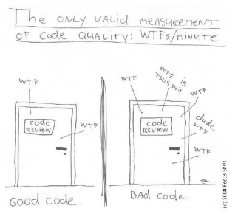

:::::::::::::::::::::::::::::::::::::: questions

- What is "Clean Code" and why is it important?
- What are the most important "Clean Code" rules?
- What tools can I use to improve my code quality towards the "Clean Code" ideal?

::::::::::::::::::::::::::::::::::::::::::::::::

::::::::::::::::::::::::::::::::::::: objectives

- Understand the importance of Clean Code
- Understand some of the fundamental Clean Code rules related to:
    - Code structure
    - Naming conventions
    - Functions
    - Comments
    - Unit tests
- Become familiar with the most important tools that can facilitate writing Clean Code

::::::::::::::::::::::::::::::::::::::::::::::::


## Introduction

Imagine you are reading a well-organized book or following a simple recipe.
Each step is clear, easy to understand, and there's no unnecessary clutter.
Now imagine the opposite—a messy, confusing set of instructions where you’re
constantly backtracking to figure out what’s going on.
**This is the difference between "clean code" and messy code in programming.**

Here are the key ideas behind **Clean Code**:

- Readable and Understandable
- Well-Organized
- Minimal but Effective
- Easy to Test
- Follows Good Practices

&nbsp;

{alt='"Clean" vs. "Messy"'}

&nbsp;


### Why Clean Code Matters:

- **For Teamwork**: Most software projects involve multiple developers. Clean code ensures everyone can collaborate without getting stuck deciphering messy work.
- **For Longevity**: Code often lives longer than you think. Writing clean code saves you time in the future when making updates.
- **For Quality**: Clean code reduces bugs and improves the user experience of the software.


::: callout

Clean Code is code that's easy to read, maintain, understand for developers and other teams while improving the quality
of their software through structure and consistency with performance demands. It lets you get the most value and purpose
out of your software.

*https://www.sonarsource.com/solutions/clean-code/*

:::

::: callout

 What is clean code, anyway? Here are some of its features:

- Clean code is obvious for other programmers.
- Clean code does not contain duplication.
- Clean code contains a minimal number of classes and other moving parts.
- Clean code passes all tests.
- Clean code is easier and cheaper to maintain!

*https://refactoring.guru/refactoring*

:::

{alt='How to measure clean code?'}

In this episode we will cover the basics of clean code, introduce some tools that facilitate writing clean code,
and end with a refactoring exercise that will allow you to put these concepts into practice.

## Clean Code Rules

In this section, we will cover some basic rules that, when followed, lead to cleaner code. It's important to recognize
that these rules are just the "tip of the iceberg," as there is much more to explore on this topic. However, adhering to
these simple guidelines can significantly improve the quality of your code. As you grow into a more experienced developer
and adopt advanced software techniques, it remains valuable to stay aligned with "clean code" principles relevant to
these practices. **Clean Code: A Handbook of Agile Software Craftsmanship** by Robert C. Martin is often regarded as the
definitive guide for the clean code movement and is highly recommended reading.

:::::::::::::::::::::::::::::::::::::::::  callout

##### Working with code samples

In this workshop you will be presented many small code samples (snippets); sometimes you will
be asked to re-factor them. To keep things neat, we advise keep all these samples
in separate source files (e.g. `example01.py`, `example02.py`, etc.) and place them under a
common `clean_code` directory. Furthermore, to ensure isolation, you should also create a
separate virtual environment for all the coding in this workshop:

```bash
$ mkdir clean_code
$ cd clean_code
$ python -m venv venv
$ source venv/bin/activate
(venv) $
```

::::::::::::::::::::::::::::::::::::::::::::::::::


### General Rules

- Follow standard conventions. Find a standard that suits you, and stick to it! For example:
    - [PEP 8 – Style Guide for Python Code](https://peps.python.org/pep-0008/)
    - [Google Python Style Guide](https://google.github.io/styleguide/pyguide.html)
- Keep it simple stupid. Simpler is always better. Reduce complexity as much as possible.
- Boy scout rule. Leave the campground cleaner than you found it.


### Source code structure

**The newspaper metaphor**: code should be organized and structured like a well-written
newspaper article: it should guide the reader from broad, general concepts to more specific
details. At the top, high-level information—such as the purpose of the code or function
should be immediately clear, similar to a headline. As the reader delves deeper, they
encounter progressively detailed logic, analogous to sections and paragraphs expanding
on the headline. This structure helps developers quickly grasp the overall intent of the
code before diving into implementation specifics, improving readability and maintainability.

There are a number of source code structure rules that derive from this metaphor:

:::::::::::::::::::::::::::::::::::::::::  callout

##### Separate concepts vertically; related code should appear vertically dense

Goal here is to make use of visual clustering, so that parts of the code that "belong" together become obvious
without having to dive deep into the actual code.

::::::::::::::::::::::::::::::::::::::::::::::::::

:::::::::::::::::::::::::::::::::::::::  challenge

##### Refactor the code below by following this guideline

```python
def calculate_total(cart, discount_rate):
    if not cart:
        raise ValueError("Cart cannot be empty.")
    if not (0 <= discount_rate <= 1):
        raise ValueError("Discount rate must be between 0 and 1.")
    subtotal = sum(item['price'] * item['quantity'] for item in cart)
    discount = subtotal * discount_rate
    total = subtotal - discount
    return total
```

:::::::::::::::  solution

```python
def calculate_total(cart, discount_rate):
    if not cart:
        raise ValueError("Cart cannot be empty.")


    if not (0 <= discount_rate <= 1):
        raise ValueError("Discount rate must be between 0 and 1.")


    subtotal = sum(item['price'] * item['quantity'] for item in cart)
    discount = subtotal * discount_rate
    total = subtotal - discount  # Related code is vertically dense


    return total
```

:::::::::::::::::::::::::

::::::::::::::::::::::::::::::::::::::::::::::::::


:::::::::::::::::::::::::::::::::::::::::  callout

##### Declare/initialize variables close to their usage.

Follows the same principle that closely related code constructs should be in close visual proximity.

::::::::::::::::::::::::::::::::::::::::::::::::::

:::::::::::::::::::::::::::::::::::::::  challenge

##### Refactor the code below by following this guideline

```python
def calculate_average_grades(students):
    total_grades = 0
    count = len(students) if students else 0
    average_grade = 0

    if not students:
        raise ValueError("The students list cannot be empty.")

    for student in students:
        total_grades += student['grade']

    average_grade = total_grades / count

    return average_grade
```

:::::::::::::::  solution

```python
def calculate_average_grades(students):
    if not students:
        raise ValueError("The students list cannot be empty.")

    total_grades = 0
    for student in students:
        total_grades += student['grade']

    count = len(students)
    average_grade = total_grades / count

    return average_grade

```

:::::::::::::::::::::::::

::::::::::::::::::::::::::::::::::::::::::::::::::


:::::::::::::::::::::::::::::::::::::::::  callout

##### Keep lines short

```python
# VERY BAD
def get_unique_even_cubed_double_of_positive_numbers(numbers):
    return list(map(lambda x: round(x**3, 2), filter(lambda x: x % 2 == 0, set(map(lambda y: y * 3, [i for i in numbers if i > 0])))))


# GOOD
def get_unique_even_cubed_tripled_of_positive_numbers(numbers):
    positive_numbers = [i for i in numbers if i > 0]
    tripled_numbers = map(lambda y: y * 3, positive_numbers)
    unique_numbers = set(tripled_numbers)
    even_numbers = filter(lambda x: x % 2 == 0, unique_numbers)

    return [round(x**3, 2) for x in even_numbers]
```

::::::::::::::::::::::::::::::::::::::::::::::::::

:::::::::::::::::::::::::::::::::::::::::  callout

##### Function placement

- Dependent functions should be close.
- Similar functions should be close.
- Place functions in the downward direction.


```python
def get_unique_even_cubed_tripled_of_positive_numbers(numbers):
    positive_numbers = filter_positive_numbers(numbers)
    tripled_numbers = triple_numbers(positive_numbers)
    unique_numbers = get_unique_numbers(tripled_numbers)
    even_numbers = get_even_numbers(unique_numbers)

    return even_numbers


def filter_positive_numbers(numbers):
    return [num for num in numbers if num > 0]


def triple_numbers(numbers):
    return [num * 3 for num in numbers]


def get_unique_numbers(numbers):
    return list(set(numbers))


def get_even_numbers(numbers):
    return [num for num in numbers if num % 2 == 0]


def cube_numbers(numbers):
    return [num ** 3 for num in numbers]
```


::::::::::::::::::::::::::::::::::::::::::::::::::


### Names rules

:::::::::::::::::::::::::::::::::::::::::  callout

##### Choose descriptive and unambiguous names

A name of a function/variable should as much as possible reveal the reason why
that function/variable is necessary, and its intended use. Choosing a good name
takes time at the start but saves time in the long-run.

If first variable use requires a comment, you are probably using the wrong name:

```python
# BAD
d = 8  # elapsed time in days

# GOOD
elapsed_time_in_days = 8
```

Choosing names that reveal intend makes code much easier to understand, and will
save you (and everyone else who will be working with your code) a lot of time in the future:

```python
# BAD
def get_them(the_list):
    list1 = []
    for x in the_list:
        if x[2] = 5:
            list1.append(x)
    return list1


# GOOD
STATUS_FIELD = 2
FLAGGED = 5

def get_flagged_cells(game_board):
    flagged_cells = []
    for cell in game_board:
        if cell[STATUS_FIELD] = FLAGGED:
             flagged_cells.append(x)
    return flagged_cells
```

::::::::::::::::::::::::::::::::::::::::::::::::::


:::::::::::::::::::::::::::::::::::::::::  callout

##### Use pronounceable names

Unpronounceable names are hard to use in a conversation. If names used in your
code are pronounceable, you can easily discuss them with your colleagues which
fosters collaboration.

```python
# BAD
def bld_dta_rcrd102(genymdhms, modymdhms):
    pszqint = "102"

    # continued in the same incomprehensible style
    # ...


# GOOD
def build_data_record_102(generation_timestamp, modification_timestamp):
    record_id = "102"

    # much easier to understand and review with your colleagues!
    # ...
```


::::::::::::::::::::::::::::::::::::::::::::::::::

:::::::::::::::::::::::::::::::::::::::::  callout

##### Use searchable names and replace magic numbers with named constants

Single letter names and "magic numbers" in the code are very difficult to
locate when you do a text search through your source code. As such, changing them
can be extremely error-prone. Replacing them with named constants can greatly
simplify this process:

```python
# BAD
def sum_up(t):
    s = 0
    ...
    for j in range(5):
        s += (t[j] * 4) / 5
    ...


# GOOD
def sum_work_days_per_week(task_estimate):
    REAL_DAYS_PER_IDEAL_DAY = 4
    WORK_DAYS_PER_WEEK = 5
    NUMBER_OF_TASKS = 5
    sum = 0
    ...
    for j in range(NUMBER_OF_TASKS):
        real_task_days = task_estimate[j] * REAL_DAYS_PER_IDEAL_DAY
        real_task_weeks = real_days / WORK_DAYS_PER_WEEK
        sum += real_task_weeks
    ...
```

::::::::::::::::::::::::::::::::::::::::::::::::::


### Functions rules

:::::::::::::::::::::::::::::::::::::::::  callout

##### Small

A function should be small enough so one could understand it without having to
do "mental jumps" between various parts of the code. Such "mental jumps" are
time consuming and tiring. Ideally, the entire function should fit on one screen.

::::::::::::::::::::::::::::::::::::::::::::::::::

:::::::::::::::::::::::::::::::::::::::  challenge

##### Refactor the code below by breaking it into smaller functions

``` python
# Dummy calibration function - operations shown here have no "real life" meaning
def calibrate_fridge(fridge_data, include_safety_checks):
    fridge_id = fridge_data.get("id")
    current_temp = fridge_data.get("current_temperature")
    target_temp = fridge_data.get("target_temperature")
    calibration_params = fridge_data.get("calibration_params")

    if include_safety_checks:
        if current_temp > calibration_params.get("max_safe_temperature"):
            raise Exception("Unsafe temperature detected during calibration.")
        if target_temp < calibration_params.get("min_safe_temperature"):
            raise Exception("Unsafe target temperature detected during calibration.")

    adjustment_factor = calibration_params.get("adjustment_factor", 1.0)
    adjusted_temp = current_temp + (target_temp - current_temp) * adjustment_factor
    if adjusted_temp > calibration_params["max_safe_temperature"]:
        adjusted_temp = calibration_params["max_safe_temperature"]
    if adjusted_temp < calibration_params["min_safe_temperature"]:
        adjusted_temp = calibration_params["min_safe_temperature"]

    stabilization_steps = calibration_params.get("stabilization_steps", 10)
    for step in range(stabilization_steps):
        correction_factor = 0.1 * (adjusted_temp - target_temp)
        adjusted_temp -= correction_factor

        if adjusted_temp < target_temp:
            adjusted_temp += 0.05  # Minor correction if under target
        elif adjusted_temp > target_temp:
            adjusted_temp -= 0.05  # Minor correction if above target

        temperature_variance = abs(adjusted_temp - target_temp)
        if temperature_variance < 0.01:
            break  # Break early if within small tolerance
        adjusted_temp -= 0.01 * temperature_variance

    fridge_data["final_temperature"] = adjusted_temp

    telemetry_data = {
        "fridge_id": fridge_id,
        "start_temp": current_temp,
        "end_temp": adjusted_temp,
        "safety_checks": include_safety_checks
    }

    print(f"Telemetry data: {telemetry_data}")

    return f"Calibration complete. Final temperature: {adjusted_temp:.2f}"
```

:::::::::::::::  solution

``` python
# Function refactored into smaller functions
def calibrate_fridge(fridge_data, include_safety_checks):
    fridge_id = fridge_data.get("id")
    current_temp = fridge_data.get("current_temperature")
    target_temp = fridge_data.get("target_temperature")
    calibration_params = fridge_data.get("calibration_params")

    if include_safety_checks:
        perform_safety_checks(current_temp, target_temp, calibration_params)

    adjusted_temp = apply_temperature_adjustment(current_temp, target_temp, calibration_params)
    stabilized_temp = stabilize_temperature(adjusted_temp, target_temp, calibration_params)
    fridge_data["final_temperature"] = stabilized_temp

    display_telemetry(fridge_id, current_temp, stabilized_temp)
    return f"Calibration complete. Final temperature: {stabilized_temp:.2f}"


def perform_safety_checks(current_temp, target_temp, calibration_params):
    if current_temp > calibration_params["max_safe_temperature"]:
        raise Exception("Unsafe temperature: Current temperature exceeds safe limits.")

    if target_temp < calibration_params["min_safe_temperature"]:
        raise Exception("Unsafe target temperature: Below safe limits.")


def apply_temperature_adjustment(current_temp, target_temp, calibration_params):
    adjustment_factor = calibration_params.get("adjustment_factor", 1.0)
    adjusted_temp = current_temp + (target_temp - current_temp) * adjustment_factor

    if adjusted_temp > calibration_params["max_safe_temperature"]:
        adjusted_temp = calibration_params["max_safe_temperature"]
    if adjusted_temp < calibration_params["min_safe_temperature"]:
        adjusted_temp = calibration_params["min_safe_temperature"]

    return adjusted_temp


def stabilize_temperature(initial_temp, target_temp, calibration_params):
    stabilization_steps = calibration_params.get("stabilization_steps", 10)
    stabilized_temp = initial_temp

    for step in range(stabilization_steps):
        correction_factor = 0.1 * (stabilized_temp - target_temp)
        stabilized_temp -= correction_factor

        if stabilized_temp < target_temp:
            stabilized_temp += 0.05  # Minor correction if under target
        elif stabilized_temp > target_temp:
            stabilized_temp -= 0.05  # Minor correction if above target

        temperature_variance = abs(stabilized_temp - target_temp)
        if temperature_variance < 0.01:
            break  # Break early if within a small tolerance
        stabilized_temp -= 0.01 * temperature_variance

    return stabilized_temp


def display_telemetry(fridge_id, start_temp, end_temp, safety_checks):
    telemetry_data = {
        "fridge_id": fridge_id,
        "start_temp": start_temp,
        "end_temp": end_temp,
    }
    print(f"Telemetry data: {telemetry_data}")

```

:::::::::::::::::::::::::

::::::::::::::::::::::::::::::::::::::::::::::::::


:::::::::::::::::::::::::::::::::::::::::  callout

##### **Single Responsibility Principle**: Do one thing at one level of abstraction

The "messy" code example above is difficult to comprehend because the code constantly jumps between different levels
of abstractions: performing low-level calibration and stabilization steps, fetching parameters, throwing
exceptions, etc. This goes against the so-called *Single Responsibility Principle* - which is a well-known rule in
object-oriented programming and software engineering - stating that a class or a function should only do one thing.

This is easy to achieve if "clean" functions should also follow our earlier "newspaper article" paradigm: the code should read
like a top-down story - so we can read the program like a narrative, descending one level of abstraction as we read
down the list of functions. This is what makes the refactored example so much easier to understand.

::::::::::::::::::::::::::::::::::::::::::::::::::


:::::::::::::::::::::::::::::::::::::::::  callout

##### Use descriptive names

This should follow the methodology already discussing under *Name rules*. In addition to this:

- Do not be afraid to use long names - the function name should pretty much describe
what the function does, to the point where comments become superfluous
- Spend time thinking of a good name, and change it as soon as you have found a better one
- Be consistent in your naming: use same phrases, nouns and verbs in your function names

::::::::::::::::::::::::::::::::::::::::::::::::::

:::::::::::::::::::::::::::::::::::::::  challenge

##### Refactor the function names below so they are consistent

``` python
def determine_optimal_temperature():
def derive_calibration_parameters():
def calculate_reset_interval():
```

:::::::::::::::  solution

``` python
def calculate_optimal_temperature():
def calculate_calibration_parameters():
def calculate_reset_interval():
```

:::::::::::::::::::::::::

::::::::::::::::::::::::::::::::::::::::::::::::::


:::::::::::::::::::::::::::::::::::::::::  callout

##### Prefer fewer arguments

- Ideally have 0-2 arguments. A high number of arguments can make functions harder to
understand, test, and reuse.
- When multiple related arguments are necessary, encapsulate them in an object or data
structure to simplify the function signature and improve readability.

```python
# BAD
def calibrate_fridge(min_temperature, max_temperature, steps, accuracy, seconds_timeout):

# GOOD
@dataclass
class CalibrationParameters:
    min_temperature: float,
    max_temperature: float,
    steps: int,
    accuracy: float,
    seconds_timeout: int

def calibrate_fridge(calibration_parameters: CalibrationParameters):
...
```

- Functions should avoid boolean or flag arguments, as they often indicate that the function
is doing more than one thing and violate the *Single Responsibility Principle*
```python
# BAD
def update_fridge_temperature(new_temperature: float, initialize_fridge: bool):

# GOOD
def initialize_fridge():
def update_fridge_temperature(new_temperature: float):

```

::::::::::::::::::::::::::::::::::::::::::::::::::


:::::::::::::::::::::::::::::::::::::::::  callout

##### Have no side effects

- Side effects break the *Single Responsibility Principle*
- No side effects facilitate parallel execution
- Side effects can lead to subtle (and occasionally catastrophic) errors!

``` python
# VERY VERY BAD

def adjust_experiment_parameters(duration_in_seconds, calibration_steps):
    set_experiment_duration(duration_in_seconds)
    set_experiment_calibration_steps(calibration_steps)
    start_experiment()
```

::::::::::::::::::::::::::::::::::::::::::::::::::


### Comments rules

As a general rule, always strive to have the code "explain itself" so comments are
not necessary. In most cases, *comments are an acceptance of failure*: the code
itself is not clear enough, so it needs additional explanation in the form of a comment.

``` python
# BAD
# Check if the experiment is complete
if status == 1:
    handle_completion()

# GOOD
if is_experiment_complete(status):
    handle_completion()
```

#### Bad Comments

In many cases comments are useless, and occasionally straight dangerous:

:::::::::::::::::::::::::::::::::::::::::  callout

##### Redundant comments

Such comments can be a distraction for the reviewer

``` python
total = price * quantity  # Multiply price by quantity
```

::::::::::::::::::::::::::::::::::::::::::::::::::


:::::::::::::::::::::::::::::::::::::::::  callout

##### Outdated or misleading comments

``` python
# BAD
# This function sorts the list in ascending order
def sort_list(data):
    return sorted(data, reverse=True)

# GOOD
def sort_list_ascending(data):
    return sorted(data)

def sort_list_descending(data):
    return sorted(data, reverse=True)
```

::::::::::::::::::::::::::::::::::::::::::::::::::


:::::::::::::::::::::::::::::::::::::::::  callout

##### Commented out code

Clutters the source code, and makes it harder to follow the natural flow of your program.
Use version control instead!

::::::::::::::::::::::::::::::::::::::::::::::::::

#### Good Comments

There are a number of cases when comments can be beneficial:

:::::::::::::::::::::::::::::::::::::::::  callout

##### Explanation of intent

``` python
# Use binary search to optimize performance on large datasets
def find_element(sorted_list, target):
    return binary_search(sorted_list, target)
```

::::::::::::::::::::::::::::::::::::::::::::::::::

:::::::::::::::::::::::::::::::::::::::::  callout

##### Clarification of code

``` python
# Flag transactions with an amount greater than 10,000 as "flagged" for manual review.
# This threshold is set by international banking regulations, specifically the
# Financial Action Task Force (FATF) Recommendation 10, to prevent money laundering.
MANUAL_REVIEW_THRESHOLD = 10000

def classify_transactions(transactions):
    for t in transactions:
        if t.amount > MANUAL_REVIEW_THRESHOLD:
            t.status = "flagged"
        else:
            t.status = "completed"

```

::::::::::::::::::::::::::::::::::::::::::::::::::

:::::::::::::::::::::::::::::::::::::::::  callout

##### Warning of consequences

```
# WARNING: This function permanently deletes experimental data.
# Ensure backups are created before calling.
def delete_experiment_data(experiment_id):
    database.delete(f"experiment_{experiment_id}")
```

::::::::::::::::::::::::::::::::::::::::::::::::::


### Unit Test Rules

Unit tests verify the functionality of individual components or functions in a program. They help detect bugs early by
isolating and testing small code units. Typically, they are written using testing frameworks like `Pytest` or `PyUnit`.

:::::::::::::::::::::::::::::::::::::::::  callout

##### Tests enable the -ilities!!

**Unit tests keep your code flexible, maintainable, and reusable - they are the key and core of clean code!**
The reason for this is that **unit tests allow you to change your code without fear of introducing new bugs**.
If you have enough unit tests with good coverage you can start with a sub-par architecture and "messy" code,
and move towards "clean" code in small and quick iterations, at each iteration being able to effectively test
that your changes have not introduced bugs.

**Unit tests enable change!**

::::::::::::::::::::::::::::::::::::::::::::::::::

:::::::::::::::::::::::::::::::::::::::::  callout

##### Unit tests should be as clean as the rest of the code

- Tests change as tested code changes!
- If tests are difficult to evolve then the overall speed one can change the program is slow
- Unit tests can be a very effective tool to document what a program does
- Clean tests allow new members of the team quickly understand the expected behaviour of the system without diving
deeply into the implementation


::::::::::::::::::::::::::::::::::::::::::::::::::


:::::::::::::::::::::::::::::::::::::::::  callout

##### Unit tests should follow the **F.I.R.S.T** principles

- **F**ast - so can be run often, so they detect problems early - when they are easy to fix
- **I**ndependent - they should not depend on each other - so they can be run in any order
- **R**epeatable - should not depend on anything in the environment - ideally not even on a network connection
being present! Should be possible to run them offline - so one can work on re-factoring even when offline
- **S**elf-validating - should return either *True* or *False*. Checking success/failure should be fast!
- **T**imely - add unit tests as soon as you have written the code, or even *before* (TDD). Forces one to think
in terms of testing => testable code.

::::::::::::::::::::::::::::::::::::::::::::::::::

:::::::::::::::::::::::::::::::::::::::::  callout

##### A unit test should cover a single concept

Having a unit test check multiple parts of the code makes it harder to reason on the cause of the failure. They are
also not self-validating - if they fail - on which part did they fail?

::::::::::::::::::::::::::::::::::::::::::::::::::

:::::::::::::::::::::::::::::::::::::::  challenge

Have a look at the unit test below. Is it "clean"? Can you name which of the "clean tests" principles discussed
so far it breaks? Can you refactor it into "clean" test code?

``` python
import pytest

def test_math_operations():
    result = 4 + 5
    if result == 9:
        print("Addition passed")
    else:
        print("Addition failed")

    result = 3 * 3
    assert result == 9  # Works, I guess

    division_result = 10 / 2
    assert division_result == 5, "Division failed"  # Check division, right?

    my_list = [1, 2, 3]
    assert len(my_list) == 3

    assert division_result == 5

    print("Test completed!")

```

:::::::::::::::  solution

### Solution

The above test breaks many of the "clean" tests and "clean" code principles:

- name does not reflect purpose
- test does not cover just one aspect of the code, but rather multiple - math operations and a completely un-related list operation
- redundant assertions - like the one for the division result
- test is not self-validating - the user needs to monitor the test output to determine success/failure
- extraneous output - "Test completed!" is unnecessary and distracts the user

Refactored test:

```python
import pytest

def test_addition():
    result = 4 + 5
    assert result == 9

def test_multiplication():
    result = 3 * 3
    assert result == 9

def test_division():
    result = 10 / 2
    assert result == 5
```
:::::::::::::::::::::::::

::::::::::::::::::::::::::::::::::::::::::::::::::


::::::::::::::::::::::::::::::::::::: keypoints

- Do not follow the clean code rules blindly; always keep in mind the guiding principles!
- Do not try to write perfect clean code at once; instead, start with "normal code" and try to continuously improve it!

::::::::::::::::::::::::::::::::::::::::::::::::


## Clean Code Tools


### PyCharm and Clean Code

Using a modern development environment, such as PyCharm, can greatly facilitate
writing clean code. Correctly configured, PyCharm can give you very useful hints on the style and content
of your code, which can greatly facilitate refactoring towards clean code. PyCharm can also do some refactoring
for you - for example changing the name of a function or variable - PyCharm will ensure the name is changed
consistently throughout the code - which is much less error prone than doing it by hand.

:::::::::::::::::::::::::::::::::::::::::  callout

##### Configuring a Python interpreter for a PyCharm project

For a given PyCharm project it is possible to setup a python interpreter, as shown below:

{alt='Running Pytest from PyCharm'}

Newer versions of PyCharm will automatically select the Python interpreter from a virtual environment if the environment
uses the default naming convention (e.g. `venv`) and is located in the project directory.

The selected interpreter can be the system-wide one, or one selected from a virtual environment.

Once a Python interpreter has been configured, PyCharm will use it to run code (e.g. `.py` files part of that project),
or analyze the code and provide useful hints to the developer:

{alt='Running Pytest from PyCharm'}

The figure above shows Pycharm hints in action: in this case the function `divide_numbers()` has not
yet been defined. PyCharm then marks the place where the undefined function is invoked in the code
with red underline, so the developer can quickly spot it. Hovering over the underline provides a
hint, in this case explaining that the function is undefined.

::::::::::::::::::::::::::::::::::::::::::::::::::


### Linters - PyLint

Pylint is a tool that helps you write cleaner, more reliable Python code by analyzing your code for errors, enforcing
coding standards, and suggesting improvements. It checks for issues like unused variables, inconsistent naming, or
missing documentation.

Pylint assigns a score to your code, ranging from -10.0 (very poor) to 10.0 (perfect). This score reflects the overall
quality of your code based on the issues Pylint identifies, weighted by their severity. Pylint also outputs each
location in your code where it has found issues that reduce your score, together with a short explanation of the problem
it has found. You can use this output to guide your code refactoring, which eventually should lead to cleaner code.

Pylint can be easily installed using `pip`:

```bash
python -m pip install pylint
```

:::::::::::::::::::::::::::::::::::::::::  callout

##### Running Pylint on a sample program

```python
# bad_pylint.py
import math  # Unused import


def addNumbers(a, b): return a + b  # Missing function docstring, bad naming style, bad formatting


def divide_numbers(a, b):
    if b == 0:
        print("Cannot divide by zero")
        return None
    return a / b


def compute_area(radius):
    Pi = 3.14  # Constant should be uppercase (naming convention)
    area = Pi * radius * radius
    return area


def main():
    result = addNumbers(5, 10)
    print("Sum is:", result)

    divide_result = divide_numbers(10, 0)
    print("Division result:", divide_result)

    radius = 5
    area = compute_area(radius)
    print(f"The area of a circle with radius {radius} is {area}")


main()
```

```text
$ python -m pylint bad_pylint.py
************* Module bad_example
bad_example.py:34:0: C0304: Final newline missing (missing-final-newline)
bad_example.py:1:0: C0114: Missing module docstring (missing-module-docstring)
bad_example.py:4:0: C0116: Missing function or method docstring (missing-function-docstring)
bad_example.py:4:0: C0103: Function name "addNumbers" doesn't conform to snake_case naming style (invalid-name)
bad_example.py:4:22: C0321: More than one statement on a single line (multiple-statements)
bad_example.py:7:0: C0116: Missing function or method docstring (missing-function-docstring)
bad_example.py:14:0: C0116: Missing function or method docstring (missing-function-docstring)
bad_example.py:20:0: C0116: Missing function or method docstring (missing-function-docstring)
bad_example.py:1:0: W0611: Unused import math (unused-import)

-----------------------------------
Your code has been rated at 5.91/10
```

::::::::::::::::::::::::::::::::::::::::::::::::::


:::::::::::::::::::::::::::::::::::::::  challenge

Fix the above warnings to bring the score to a perfect 10!

:::::::::::::::  solution

```python
"""This module provides basic mathematical operations and area computation."""


def add_numbers(a, b):
    """Adds two numbers and returns the result."""
    return a + b


def divide_numbers(a, b):
    """Divides two numbers and returns the result.

    Prints an error message if division by zero is attempted.
    """
    if b == 0:
        print("Cannot divide by zero")  # pylint MAY suggest logging here
        return None
    return a / b


def compute_area(radius):
    """Computes the area of a circle given its radius."""
    pi = 3.14  # Use lowercase for variables
    return pi * radius * radius


def main():
    """Main function to demonstrate the usage of mathematical operations."""
    result = add_numbers(5, 10)
    print("Sum is:", result)

    divide_result = divide_numbers(10, 0)
    print("Division result:", divide_result)

    radius = 5
    area = compute_area(radius)
    print(f"The area of a circle with radius {radius} is {area}")


if __name__ == "__main__":
    main()

```

```text
(test11) bcpopescu@TUD264038:~/projects/examples$ pylint good_pylint.py

-------------------------------------------------------------------
Your code has been rated at 10.00/10 (previous run: 5.91/10, +4.09)
```

:::::::::::::::::::::::::

::::::::::::::::::::::::::::::::::::::::::::::::::

:::::::::::::::::::::::::::::::::::::::::  callout

##### Instructing Pylint to ignore certain rules

Pylint is a great tool, but sometimes you may want to ignore some of its advices - for example when they may not be
suitable for the overall coding style you have chosen for your project, or when certain rule does not make sense for
a given function/file in your project.

Disabling a Pylint rule for a specific function is very simple - just add a comment next to that function definition,
like this:

```python
def my_function():  # pylint: disable=missing-function-docstring
    pass
```

To disable that rule for the entire file, add the same comment at the top of the file:

```python
# pylint: disable=missing-function-docstring
```

It is also possible to create custom Pylint configuration files for your project, as explained in the
[documentation](https://pylint.pycqa.org/en/stable/user_guide/configuration/index.html?utm_source=)

::::::::::::::::::::::::::::::::::::::::::::::::::


### Pytest - a simple yet powerful unit test framework

We have already discussed the importance of unit tests in the context of clean code. Unit tests become even more
powerful in facilitating change when they are used together with unit test frameworks. Such frameworks make
it very easy to write and execute unit tests, and typically integrate smoothly with modern IDEs such as PyCharm.
`Pytest` is a simple yet powerful such framework, specifically designed for testing Python code.

`Pytest` is an external Python package, so before we can use it, we need to install it via `pip`:

```bash
$ python -m pip install pytest
```

With `Pytest` installed, you can write tests as regular functions and run
them easily. As an example consider this simple function:

```python
# in simple_function.py

def simple_function(a, b):
    return a + b
```

With `Pytest`, you can test it by creating a new file `test_simple_function.py`:

```python
# in test_simple_function.py

from simple_function import simple_function


def test_simple_function():
    assert simple_function(2, 3) == 5
```

and then running `pytest` from the command line:

```bash
$ python -m pytest
============================= test session starts =============================
platform win32 -- Python 3.11.8, pytest-8.0.2, pluggy-1.4.0
rootdir: C:\projects\examples
plugins: anyio-4.3.0, flaky-3.7.0, cov-4.1.0, mock-3.12.0
collected 1 item

test_simple_function.py .                                                [100%]

============================== 1 passed in 0.02s ==============================
```


By default, when running `pytest` from the
command line, this package will look for any files named `test_*.py` or `*_test.py` in the working directory, and
from these files run any functions names `test_*`. Inside these functions, you can test functionality using the
`assert` keyword. A test function is assumed to fail if any `assert` fails, or if the the test function throws an exception.
Alternatively, the test function succeeds if it completes without any failed asserts or exceptions. After running
all tests, `Pytest` will display the number of tests that have succeeded and failed.

Alternatively, `Pytest` can be invoked directly from the PyCharm environment as shown below:

{alt='Running Pytest from PyCharm'}


### Test Coverage

**Test coverage** is a way to measure how much of your code is tested by your test cases. It helps you understand how
well your tests are checking the functionality of your program and ensures that your code behaves as expected.

Think of your code as a map, and your tests as explorers. Test coverage tells you how much of the map has been explored.
If there are unexplored areas (untested code), they might hide bugs or unexpected behaviors.

:::::::::::::::::::::::::::::::::::::::::  callout

##### Why Test Coverage is Important

- **Finding Bugs Early:** By ensuring most of your code is tested, you can catch issues early in development.
- **Improved Confidence:** High test coverage makes you more confident that changes to the code won’t break existing functionality.
- **Code Quality:** Writing tests often leads to better structured and easier-to-maintain code.

::::::::::::::::::::::::::::::::::::::::::::::::::

:::::::::::::::::::::::::::::::::::::::::  callout

##### Coverage is a Guide, Not a Goal

While high test coverage is beneficial, **it is not a guarantee that your code is bug-free**. It is possible to have 100%
coverage and still miss edge cases or logical errors. Focus on writing meaningful tests that cover real-world scenarios.

::::::::::::::::::::::::::::::::::::::::::::::::::

### The **coverage.py** Tool

**coverage.py** is a commonly-used Python tool for measuring test coverage. It helps you understand how much of your
code is executed during tests and identifies untested parts. It is lightweight, easy to use, and integrates well with
various testing frameworks like pytest.

##### Installing coverage.py

To use *coverage.py* you will need to install it first. This can be easily done using *pip*:

```bash
python -m pip install coverage
```

You can then verify the installation:

```bash
python -m coverage --version
```
``` output
Coverage.py, version 7.4.3 with C extension
Full documentation is at https://coverage.readthedocs.io/en/7.4.3
```

##### Running coverage.py

For this section, we will use a simple example, where we are developing a *math_utils.py* library:

```python
# math_utils.py

def add(a, b):
    return a + b

def subtract(a, b):
    return a - b

def multiply(a, b):
    return a * b

def divide(a, b):
    if b == 0:
        raise ValueError("Cannot divide by zero")
    return a / b
```

which we then test using unit tests in a *test_math_utils.py* file:

```python
# test_math_utils.py

from math_utils import add, subtract, multiply, divide
import pytest

def test_add():
    assert add(2, 3) == 5

def test_subtract():
    assert subtract(0, 1) == -1

def test_multiply():
    assert multiply(2, 3) == 6

def test_divide():
    assert divide(-6, 2) == -3
```


The *coverage.py* tool is typically used in conjunction with a testing framework, such as *pytest*; to use the tool,
instead of running your tests directly (e.g. with `pytest`), use `coverage run` instead:

```bash
python -m coverage run -m pytest test_math_utils.py
```

```output
$ python -m coverage run -m pytest test_math_utils.py
============================= test session starts =============================
platform win32 -- Python 3.8.8, pytest-8.1.1, pluggy-1.4.0
rootdir: C:\projects\programming_course\prosoftdev-research\coverage
plugins: anyio-4.3.0, flaky-3.8.0, cov-4.1.0, mock-3.12.0
collected 4 items

test_math_utils.py ....                                                  [100%]

```

Once you have run the *coverage.py* tool, it is possible to generate a coverage report:

```bash
python -m coverage report -m
```

```output
$ python -m coverage report -m

Name                 Stmts   Miss  Cover   Missing
--------------------------------------------------
math_utils.py           10      1    90%   14
test_math_utils.py      10      0   100%
--------------------------------------------------
TOTAL                   20      1    95%
```

As you can see, in this (simple) case we have achieved a very high coverage ratio with relative ease.

##### Visualizing test coverage

To make the results more user-friendly, *coverage.py* can generate an HTML report.

```bash
python -m coverage html
```

This creates a directory named *htmlcov* containing detailed coverage reports. To visualize the report, you
need to open the *index.html* file in the *htmlcov* directory:

{alt='HTML coverage overview'}

Even more useful, you can drill down to the test coverage of individual files, by clicking on the file name in
the overview. This shows the test coverage at the level of lines of code:

{alt='HTML coverage per file'}

By using such visual tools you can quickly zoom on untested parts of your codebase, so that you can add additional tests
for covering them.


## Final Project

In this last hour of the last workshop of this course, you will get the chance to apply most of the material covered
in this course in a final project. For this final project we will be using this Python program, which is an expanded
version of a challenge you have already seen earlier in this course:

```python
import numpy as np


# Dummy calibration function - operations shown here have no "real life" meaning
def calibrate_fridge(fridge_data, include_safety_checks):
    fridge_id = fridge_data.get("id")
    current_temp = fridge_data.get("current_temperature")
    target_temp = fridge_data.get("target_temperature")
    calibration_params = fridge_data.get("calibration_params")
    experiment_params = fridge_data.get("experiment_params")

    if include_safety_checks:
        if current_temp > calibration_params.get("max_safe_temperature"):
            raise Exception("Unsafe temperature detected during calibration.")
        if target_temp < calibration_params.get("min_safe_temperature"):
            raise Exception("Unsafe target temperature detected during calibration.")

    adjustment_factor = calibration_params.get("adjustment_factor", 1.0)
    adjusted_temp = current_temp + (target_temp - current_temp) * adjustment_factor
    if adjusted_temp > calibration_params["max_safe_temperature"]:
        adjusted_temp = calibration_params["max_safe_temperature"]
    if adjusted_temp < calibration_params["min_safe_temperature"]:
        adjusted_temp = calibration_params["min_safe_temperature"]

    stabilization_steps = calibration_params.get("stabilization_steps", 10)
    operating_temperature = adjusted_temp
    for step in range(stabilization_steps):
        correction_factor = 0.1 * (operating_temperature - target_temp)
        operating_temperature -= correction_factor

        if operating_temperature < target_temp:
            operating_temperature += 0.05  # Minor correction if under target
        elif operating_temperature > target_temp:
            operating_temperature -= 0.05  # Minor correction if above target

        temperature_variance = abs(operating_temperature - target_temp)
        if temperature_variance < 0.01:
            break  # Break early if within small tolerance
        operating_temperature -= 0.01 * temperature_variance

    telemetry_data = {
        "fridge_id": fridge_id,
        "adjusted_temp": adjusted_temp,
        "safety_checks": include_safety_checks,
        "operating_temperature": operating_temperature
    }

    # Experiment calibration logic
    scaling_factor = experiment_params.get("scaling_factor", 1.2)
    offset_value = experiment_params.get("offset_value", 3)
    smoothing_coefficient = experiment_params.get("smoothing_coefficient", 0.8)
    window_size = experiment_params.get("window_size", 5)
    modulation_factor = experiment_params.get("modulation_factor", 0.05)
    experiment_data = fridge_data.get("experiment_data", [])

    if len(experiment_data) != 20:
        raise ValueError("Calibration data must have exactly 20 readings")

    experiment_data = np.array(experiment_data)
    scaled_data = experiment_data * scaling_factor - offset_value
    smoothed_data = np.convolve(scaled_data, np.ones(window_size) / window_size, mode='valid')
    adjusted_data = smoothed_data * (1 + modulation_factor * np.sin(smoothed_data))
    experiment_temperature_adjustment = np.tanh(
        np.average(adjusted_data, weights=np.linspace(1, 2, len(adjusted_data))) / 10)

    experiment_temperature = operating_temperature + experiment_temperature_adjustment

    experiment_outputs = {
        "mean_before_adjustment": np.mean(experiment_data),
        "std_dev_before_adjustment": np.std(experiment_data),
        "mean_after_adjustment": np.mean(adjusted_data),
        "experiment_temperature_adjustment": experiment_temperature_adjustment,
        "calibration_factor": scaling_factor * smoothing_coefficient / (1 + abs(modulation_factor)),
        "experiment_temperature": experiment_temperature
    }

    return telemetry_data, experiment_outputs


def main():
    fridge_data = {
        "id": "fridge123",
        "current_temperature": 5.0,
        "target_temperature": 2.85,
        "calibration_params": {
            "max_safe_temperature": 6.8,
            "min_safe_temperature": 2.1,
            "adjustment_factor": 1.05,
            "stabilization_steps": 10
        },
        "experiment_params": {
            "scaling_factor": 1.1,
            "offset_value": 2,
            "smoothing_coefficient": 0.9,
            "window_size": 3,
            "modulation_factor": 0.03
        },
        "experiment_data": [10.1, -6.8, 9.8, -10.3, -9.9, 12.0, 10.1, 10.2, 10.1, 9.7, -15.1,
                            8.1, 1-1.2, 10.3, 10.0, 10.1, 7.2, 9.8, 9.9, -9.7]
    }

    include_safety_checks = True

    # Run the function
    telemetry_data, experiment_outputs = calibrate_fridge(fridge_data, include_safety_checks)

    # Print results
    print("Telemetry Data:", telemetry_data)
    print("Experiment Outputs:", experiment_outputs)

# Run main function
if __name__ == "__main__":
    main()


```
Given this code, the challenge/final project of this course is the following:

:::::::::::::::::::::::::::::::::::::::  challenge

##### Final Project

1. The code shown above is available [here](https://gitlab.tudelft.nl/bcpopescu/imsep_final_project/)
    - clone this repo on your local machine
    - create a separate branch `final_project_<username>` where you will do your work
2. In your local working directory for this project, create a new Python 3.12 virtual environment
and activate it.
3. Install all necessary packages and run the calibration function
4. Start creating unit tests for the calibration function. Assume the calibration function *as given* is correct.
5. Run the unit tests, and check the code coverage; keep adding unit tests until you have a very high code
coverage - you should aim for 100%!
6. Run your code through `pylint`. Note the issues `pylint` identifies in your code, and its initial score.
7. Start refactoring the code - taking into account `pylint's` findings, and applying all techniques you have
learned in this workshop.
    - Make a plan of what you want to refactor, and in which order.
    - Use the PyCharm refactoring tools to help you speed up this process.
    - Work in small steps; after each refactoring step re-run the unit tests and make sure they pass!
    - If tests start to fail - fix them; if you get stuck, use git to restore your code to a version
    where the tests were passing, and re-start from there.
    - After each successful refactoring step commit your changes to git.
    - After each refactoring step, re-run `pylint` and notice how your score is improving.

::::::::::::::::::::::::::::::::::::::::::::::::::


