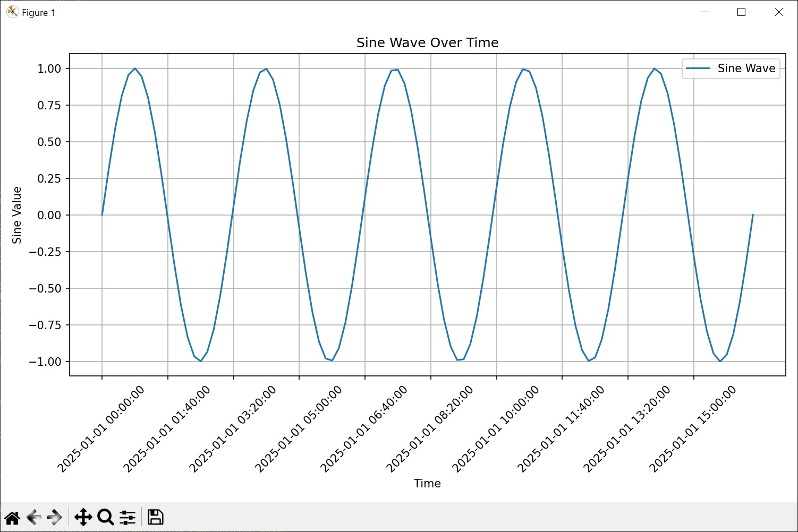

::::::::::::::::::::::::::::::::::::::: objectives

- Understand the problems Python virtual environments help solve
- Set up a Python virtual environment for our software project using `venv` and `pip`.
- Managing external packages with `pip`
- Exporting/Importing Virtual Environments

::::::::::::::::::::::::::::::::::::::::::::::::::

:::::::::::::::::::::::::::::::::::::::: questions

- What are virtual environments in software development and why you should use them?
- How can we manage Python virtual environments and external (third-party) libraries?

::::::::::::::::::::::::::::::::::::::::::::::::::


## Introduction

Up to now in this course we have focused on version control and `git`. We have seen how these
tools provide isolation, reproducibility, and control over changes at the *source code* level.

However a running program is more than just its source code; the environment/OS where it runs,
the version of the programming language, as well as the external libraries it is using can also
have a significant influence over its results.

In this episode we will pivot away from version control, and start looking at these other "externalities"
that influence program behaviour. The goal, as with version control is to provide tools that
allow us to control how these "externalities" influence our running programs, and provide
the same isolation, reproducibility, and control over changes that version control can
provide over our source code.

We will focus our discussion on Python and its tools ecosystem, as this is the language
mostly used at QuTech and in the broader scientific community.

In the context of Python, the widely used solution to managing all the externalities mention above
is *Python virtual environments*. For the rest of this episode we will explore ways to
use these virtual environments so we can manage our running program "externalities" pretty much
the same way we manage its source code via version control and git.


## Python Virtual Environments

So what exactly are virtual environments, and why use them?

A Python virtual environment helps us create an **isolated working copy** of a software project
that uses a specific version of Python interpreter together with specific versions of a number of external libraries
installed into that virtual environment. Python virtual environments are implemented as directories with a particular
structure within software projects, containing links to specified dependencies allowing isolation from other software
projects on your machine that may require different versions of Python or external libraries.

As more external libraries are added to your Python project over time, you can add them to its specific virtual
environment and avoid a great deal of confusion by having separate (smaller) virtual environments for each project
rather than one huge global environment with potential package version clashes. Another big motivator for using
virtual environments is that they make sharing your code with others much easier (as we will see shortly). Here
are some typical scenarios where the use of virtual environments is highly recommended (almost unavoidable):

- You have an older project that only works under Python 2. You do not have the time to migrate the project to Python 3
  or it may not even be possible as some of the third party dependencies
  are not available under Python 3. You have to start another project under Python 3.
  The best way to do this on a single machine is to set up two separate Python virtual environments.
- One of your Python 3 projects is locked to use a particular older version of a third party library.
  You cannot use the latest version of the dependency as it breaks things in your project. In a separate branch of
  your project, you want to try and fix problems introduced by the new version of the dependency
  without affecting the working version of your project. You need to set up a separate virtual environment for
  your branch to 'isolate' your code while testing the new feature.

You do not have to worry too much about specific versions of external libraries
that your project depends on most of the time. Virtual environments also enable you to always use
the latest available version without specifying it explicitly.
They also enable you to use a specific older version of a package for your project, should you need to.

::: callout
### A Specific Python or Package Version is Only Ever Installed Once
Note that you will not have a separate Python or package installations for each of your projects -
they will only ever be installed once on your system but will be referenced
from different virtual environments.
:::

## Tools for Managing Python Virtual Environments and External Packages

There are several commonly used command line tools for creating and managing Python virtual environments:

- `venv`, available by default from the standard `Python` distribution from `Python 3.3+`
- `virtualenv`, needs to be installed separately but supports both `Python 2.7+` and `Python 3.3+`versions
- `pipenv`, created to fix certain shortcomings of `virtualenv`
- `conda`, package and environment management system
  (also included as part of the Anaconda Python distribution often used by the scientific community)
- `poetry`, a modern Python packaging tool which handles virtual environments automatically

Part of managing your (virtual) working environment involves installing, updating and removing external packages on
your system. Here as well there are plenty of tools and technologies to choose from:

- `pip` - the most commonly used Python package manager - it interacts and obtains the
packages from the central repository called [Python Package Index (PyPI)](https://pypi.org/)
- `easy_install` - a legacy package manager now largely replaced by `pip`
- `pdm` - a modern Python package manager that follows the latest Python community guidelines, but doesn't enforce virtual environments
- `uv` - a new and very fast Python package manager intended to eventually replace `pip`
- `conda`
- `poetry`

### Many Tools for the Job

Installing and managing Python distributions, external libraries and virtual environments is, well, complex.
There is an abundance of tools for each task, each with its advantages and disadvantages,
and there are different ways to achieve the same effect (and even different ways to install the same tool!).
Note that each Python distribution comes with its own version of `pip` - and if you have several Python versions
installed you have to be extra careful to use the correct `pip` to manage external packages for that Python version.

For a novice in this area it is very easy to quickly get overwhelmed, leading to situation like this:


<p style="text-align: center;"> Python Environment Hell <br>
From <a href="https://xkcd.com/1987/" target="_blank">XKCD</a> (Creative Commons Attribution-NonCommercial 2.5 License)</p>

In order to avoid this "Python environment hell" problem, in this course we will only focus on `venv` and `pip`.
Only focusing on these has several advantages, especially for novice users:

- `venv` and `pip` have been around for quite a while, they are widely used, are very stable, and there is ample online
documentation for both of them.
- `venv` and `pip` are quite low-level, and minimalistic, so you do not have to deal with
the feature explosion and bloatware that other tools may experience.
- finally, many of the more high-level tools use the functionality provided by `venv` and `pip` as building blocks,
so having a good understanding of these provides a solid foundation to expand to more sophisticated tools.

In the next sections we will look at how to use `venv` and `pip` from the command line, similar to the approach
we took when learning `git`

::: callout
### Making Sure You Can Invoke Python
You can test your Python installation from the command line with:

```bash
$ python3 --version # on Mac/Linux
$ python --version # on Windows — Windows installation comes with a python.exe file rather than a python3.exe file
```

:::

::: callout

### Python Hangs in Git Bash on Windows

If you are using Windows and invoking `python` command causes your Git Bash terminal to hang with no error
message or output, you may have to use `winpty` - a Windows software package providing an interface similar to a
Unix pty-master for communicating with Windows command line tools. Inside the shell type:

```bash
alias python="winpty python.exe"
```

This alias will be valid for the duration of the shell session. For a more permanent solution, from the shell do:

```bash
$ echo "alias python='winpty python.exe'" >> ~/.bashrc
$ source ~/.bashrc
```

:::

## A Motivating Example
For the rest of this episode, we will use the following (simple) Python program as a motivation on where virtual
environments may be useful:

```python
import numpy as np
import matplotlib.pyplot as plt
from dateutil import parser
from datetime import timedelta

# Generate time data using python-dateutil and timedelta
start_time = parser.parse("2025-01-01T00:00:00")
time_steps = [start_time + timedelta(minutes=10 * i) for i in range(100)]
time_values = [t.strftime("%Y-%m-%d %H:%M:%S") for t in time_steps]

print(f"Plotting a sine wave starting at {start_time} in 100 steps of 10 minutes")

# Create the sine wave data using numpy
x_values = np.linspace(0, 10 * np.pi, 100)  # 100 points from 0 to 10*pi
y_values = np.sin(x_values)

# Plot the data
plt.figure(figsize=(10, 6))
plt.plot(time_values, y_values, label="Sine Wave")
tick_step = 10
plt.xticks(range(0, len(time_values), tick_step), time_values[::tick_step], rotation=45)

plt.xlabel("Time")
plt.ylabel("Sine Value")
plt.title("Sine Wave Over Time")
plt.grid(True)
plt.tight_layout()
plt.legend()
plt.show()
```

On your system, create a new directory *sine_wave*, and copy the above code in a file *plot_sine_wave.py*.
We want to see what happens if we try to run this program on a system where Python has just been installed,
and for this, we will create a new Python virtual environment.


## Creating Virtual Environments Using `venv`

Creating a virtual environment with `venv` is done by executing the following command:

```bash
$ python -m venv /path/to/new/virtual/environment
```

In Windows (GitBash), you can do the same with the following command:

```bash
$  py -3 -m venv /path/to/new/virtual/environment
```


where `/path/to/new/virtual/environment` is a path to a directory where you want to place it - conventionally within
your software project so they are co-located. This will create the target directory for the virtual environment
(and any parent directories that don’t exist already).

::: callout
### What is `-m` Flag in `python` Command?
The Python `-m` flag means "module" and tells the Python interpreter to treat what follows `-m` as the name of a module
and not as a single, executable program with the same name. Some modules (such as `venv` or `pip`) have main entry
points and the `-m` flag can be used to invoke them on the command line via the `python` command. The main difference
between running such modules as standalone programs (e.g. executing "venv" by running the `venv` command directly)
versus using `python -m` command is that with the latter you are in full control of which Python module will be invoked
(the one that came with your environment's Python interpreter vs. some other version you may have on your system).
This makes it a more reliable way to set things up correctly and avoid issues that could prove difficult to trace and debug.
:::

For our project let us create a virtual environment called "venv".
First, ensure you are within the project root directory (*sine_wave*), then:

```bash
$ python -m venv venv
```

If you list the contents of the newly created directory "venv", on a Mac or Linux system
(slightly different on Windows as explained below) you should see something like:

```bash
$ ls -l venv
```

```output
total 8
drwxr-xr-x  12 alex  staff  384  5 Oct 11:47 bin
drwxr-xr-x   2 alex  staff   64  5 Oct 11:47 include
drwxr-xr-x   3 alex  staff   96  5 Oct 11:47 lib
-rw-r--r--   1 alex  staff   90  5 Oct 11:47 pyvenv.cfg
```

So, running the `python -m venv venv` command created the target directory called "venv" containing:

- `pyvenv.cfg` configuration file with a home key pointing to the Python installation from which the command was run,
- `bin` subdirectory (called `Scripts` on Windows) containing a symlink of the Python interpreter binary used to
   create the environment and the standard Python library,
- `lib/pythonX.Y/site-packages` subdirectory (called `Lib\site-packages` on Windows)
  to contain its own independent set of installed Python packages isolated from other projects, and
- various other configuration and supporting files and subdirectories.

::: callout
### Naming Virtual Environments
What is a good name to use for a virtual environment?

Using "venv" or ".venv" as the name for an environment and storing it within the project's directory seems to be the
recommended way - this way when you come across such a subdirectory within a software project,
by convention you know it contains its virtual environment details.

A slight downside is that all different virtual environments on your machine
then use the same name and the current one is determined by the context of the path you are currently located in.
A (non-conventional) alternative is to use your project name for the name of the virtual environment,
with the downside that there is nothing to indicate that such a directory contains a virtual environment.

For this episode we will use the name "venv" instead of ".venv" since it is not a hidden directory and we want
it to be displayed by the command line when listing directory contents. In the future, you should decide what naming
convention works best for you. Here are some references for each of the naming conventions:

- [The Hitchhiker's Guide to Python](https://docs.python-guide.org/dev/virtualenvs/)
  notes that "venv" is the general convention used globally
- [The Python Documentation](https://docs.python.org/3/library/venv.html)
  indicates that ".venv" is common
- ["venv" vs ".venv" discussion](https://discuss.python.org/t/trying-to-come-up-with-a-default-directory-name-for-virtual-environments/3750)
:::

Once you’ve created a virtual environment, you will need to activate it.

On Mac or Linux, it is done as:

```bash
$ source venv/bin/activate
(venv) $
```

On Windows, recall that we have `Scripts` directory instead of `bin` and activating a virtual environment is done as:

```bash
$ source venv/Scripts/activate
(venv) $
```

Activating the virtual environment will change your command line’s prompt to show what virtual environment you are
currently using (indicated by its name in round brackets at the start of the prompt), and modify the environment
so that running Python will get you the particular version of Python configured in your virtual environment.

You can now verify you are using your virtual environment's version of Python:

```bash
(venv) $  python --version
```

```output
Python 3.12.9
```

When you’re done working on your project, you can exit the environment with:

```bash
(venv) $ deactivate
```

If you have just done the `deactivate`, ensure you reactivate the environment ready for the next part:

```bash
$ source venv/bin/activate
(venv) $
```

::: callout
### Python Within A Virtual Environment

Within an active virtual environment, commands like `python3` and `python` should both refer to the
version of Python 3 you created the environment with (note you may have multiple Python 3 versions installed).

However, on some machines with Python 2 installed, `python` command may still be hardwired to the
copy of Python 2 installed outside of the virtual environment - this can cause errors and confusion.

To make it even more confusing, `python3` may also not work on newer versions of Windows (where
Python 2 is deemed obsolete - hence `python` deemed to be sufficient)

You can always check which version of Python you are using in your virtual environment with the
command `which python` to be absolutely sure. We will be using `python` in this material since this should work
on most modern systems, but if this points to Python 2 on your system you may have to use `python3`.
:::


## Installing External Packages Using `pip`

Now that we have a virtual environment, let us try to run the *plot_sine_wave.py* program:

```bash
python plot_sine_wave.py
```
```output
Traceback (most recent call last):
  File "C:\projects\programming_course\sine_wave\plot_sine_wave.py", line 1, in <module>
    import numpy as np
ModuleNotFoundError: No module named 'numpy'
```

As we can see in the code ('includes'), our code depends on a number of external libraries -
`numpy`, `matplotlib`, and `python-dateutil`. In order for the code to run on your machine, you need to
install these three dependencies into your virtual environment.

To install the latest version of a package with `pip` you use pip's `install` command and specify the
package’s name, e.g.:

```bash
(venv) $ python -m pip install numpy
(venv) $ python -m pip install matplotlib
(venv) $ python -m pip install python-dateutil
```

or like this to install multiple packages at once for short:

```bash
(venv) $ python -m pip install numpy matplotlib python-dateutil
```

::: callout
#### How About `pip install <package-name>` Command?
You may have seen or used the `pip install <package-name>` command in the past, which is shorter
and perhaps more intuitive than `python -m pip install`. However, the
[official Pip documentation](https://pip.pypa.io/en/stable/user_guide/#running-pip) recommends
`python -m pip install` and core Python developer Brett Cannon offers a
[more detailed explanation](https://snarky.ca/why-you-should-use-python-m-pip/)
of edge cases when the two commands may produce different results and why `python -m pip install`
is recommended. In this material, we will use `python -m` whenever we have to invoke a Python
module from command line.
:::

If you run the `python -m pip install` command on a package that is already installed,
`pip` will notice this and do nothing.

To display information about a particular installed package do:

```bash
(venv) $ python -m pip show numpy
```

```output
Name: numpy
Version: 2.2.3
Summary: Fundamental package for array computing in Python
Home-page:
Author: Travis E. Oliphant et al.
Author-email:
License: Copyright (c) 2005-2024, NumPy Developers.
 All rights reserved.
...
```

::: callout

#### `pip install` Flags

`pip install` allows you to precisely control the version of the library it will install through its command flags.
Some of the most commonly-used flags are shown here:

- To install a specific version of a Python package give the package name followed by `==` and the version number,
e.g. `python -m pip install numpy==2.2.3`.
- To specify a minimum version of a Python package, you can do `python -m pip install numpy>=1.20`.
- To upgrade a package to the latest version, e.g. `python3 -m pip install --upgrade numpy`.

:::

Once packages have been installed, it is often useful to get an overview of everything present in a virtual environment.
For this, `pip` provides a handy command called `list`:

```bash
(venv) $ python -m pip list
```

```output
Package         Version
--------------- -----------
contourpy       1.3.1
cycler          0.12.1
fonttools       4.55.3
kiwisolver      1.4.8
matplotlib      3.10.0
numpy           2.2.1
packaging       24.2
pillow          11.1.0
pip             23.2.1
pyparsing       3.2.1
python-dateutil 2.9.0.post0
six             1.17.0
```

Finally, installed packages can be un-installed using the `uninstall` command: `python -m pip uninstall <package-name>`.
You can also supply a list of packages to uninstall at the same time.

:::::::::::::::::::::::::::::::::::::::  challenge

##### Practice various `pip` operations

For this challenge create a new virtual environment `venv-scratch` on your working directory

- Activate the new virtual environment
- Install numpy version 1.0.3
- Upgrade numpy to version 1.6.1
- Upgrade numpy to version 1.26.1
- Upgrade numpy to version 1.26.3
- Upgrade numpy to the latest version
- Uninstall numpy from `venv-scratch`
- Remove the `venv-scratch` virtual environment


:::::::::::::::  solution

##### Solution

- Numpy version 1.0.3 does not exist - when you try to install it `pip` will give an error message
  This shows you that `pip` is robust - it will not mess up if you try to uninstall non-existing package versions.
- Numpy version 1.6.1 *does* exist, but it will not install with the Python 3.12 version that you are using.
  `pip` will attempt the installation, and fail in the process. This again shows that `pip` is robust
  even when it fails in the middle of an installation it is able to successfully rollback.
- `python -m pip install numpy==1.26.1` - should succeed
- `python -m pip install numpy==1.26.3` - should succeed
- `python -m pip install --upgrade numpy` - should succeed - and upgrade *numpy* to its latest version (2.2.3)
- `python -m pip uninstall numpy` - should succeed
- removing a Python virtual environment is as easy as removing its root folder, so:

```bash
(venv-scratch) $ deactivate
$ rm -rf venv-scratch
```

:::::::::::::::::::::::::

::::::::::::::::::::::::::::::::::::::::::::::::::


### Exporting/Importing Virtual Environments Using `pip`

You are collaborating on a project with a team so, naturally, you will want to share your environment with your
collaborators so they can easily 'clone' your software project with all of its dependencies and everyone can replicate
equivalent virtual environments on their machines. `pip` has a handy way of exporting, saving and sharing
virtual environments.

To export your active environment - use `python3 -m pip freeze` command to produce a list of packages installed in the
virtual environment. A common convention is to put this list in a `requirements.txt` file:

```bash
(venv) $ python -m pip freeze > requirements.txt
(venv) $ cat requirements.txt
```

```output
contourpy==1.3.1
cycler==0.12.1
fonttools==4.55.3
kiwisolver==1.4.8
matplotlib==3.10.0
numpy==2.2.1
packaging==24.2
pillow==11.1.0
pyparsing==3.2.1
python-dateutil==2.9.0.post0
six==1.17.0
```

The first of the above commands will create a `requirements.txt` file in your current directory. Yours may look a little
different, depending on the version of the packages you have installed, as well as any differences in the packages
that they themselves use.

The `requirements.txt` file can then be added/committed to the Git repo for your project and get shipped as part of
your software and shared with collaborators and/or users.

To see how this `requirements.txt` can be used to re-create a virtual environment, let us practice creating an
identical copy of our first virtual environment in a different directory. Let us first create a new
virtual environment - `venv_copy` - like this:

```bash
$ deactivate
$ cd ..
$ mkdir venv_copy
$ cd venv_copy
$ python -m venv venv_copy
$ source venv_copy/bin/activate
(venv_copy) $
```

They can then replicate your original environment and install all the original packages by first
copying the `requirements.txt` to the new virtual environment root directory, and then running
a version of the `pip install` command:

```bash
(venv_copy) $ python -m pip install -r requirements.txt
```

As your project grows - you may need to update your environment for a variety of reasons. For example, one of your
project's dependencies has just released a new version (dependency version number update), you need an additional
package for data analysis (adding a new dependency) or you have found a better package and no longer need the older
package (adding a new and removing an old dependency). What you need to do in this case (apart from installing the new
and removing the packages that are no longer needed from your virtual environment) is update the contents of the
`requirements.txt` file accordingly by re-issuing `pip freeze` command and propagate the updated `requirements.txt`
file to your collaborators via your code sharing platform (e.g. GitLab).

::: callout
#### Official Documentation
For a full list of options and commands,
consult the [official `venv` documentation](https://docs.python.org/3/library/venv.html)
and the [Installing Python Modules with `pip` guide](https://docs.python.org/3/installing/index.html#installing-index).
Also check out the guide
["Installing packages using `pip` and virtual environments"](https://packaging.python.org/guides/installing-using-pip-and-virtual-environments/#installing-packages-using-pip-and-virtual-environments).
:::

## Putting it All Together
Congratulations! Your environment is now activated and set up to run our `plot_sine_wave.py` program from the command line.

You should already be located in the root of the `sine_wave` directory (if not, please navigate to it from the command line now).
When you run this program from the command line:

```bash
(venv) $ python plot_sine_wave.py
```

You should now see the following plot:

{alt="Sine Wave Plot" .image-with-shadow width="600px"}


:::::::::::::::::::::::::::::::::::::::  challenge

### Multiple Python versions on the same machine

Using virtual environments it is very easy to manage multiple Python versions on the same machine.
As a challenge, install Python 3.5 on your system, and create a virtual environment specifically for it.
Then try to run *plot_sine_wave.py* in this new environment. Does it work? Modify the program so it does.


::::::::::::::::::::::::::::::::::::::::::::::::::


&nbsp;
&nbsp;
&nbsp;

:::::::::::::::::::::::::::::::::::::::: keypoints
- "Virtual environments keep Python versions and dependencies required by different projects separate."
- "A virtual environment is itself a directory structure."
- "Use `venv` to create and manage Python virtual environments."
- "Use `pip` to install and manage Python external (third-party) libraries."
- "`pip` allows you to declare all dependencies for a project in a separate
file (by convention called `requirements.txt`) which can be shared with collaborators/users and used to replicate a virtual environment."
- "Use `python -m pip freeze > requirements.txt` to take snapshot of your project's dependencies."
- "Use `python -m pip install -r requirements.txt` to replicate someone else's virtual environment on your machine from
the `requirements.txt` file."
::::::::::::::::::::::::::::::::::::::::::::::::::


