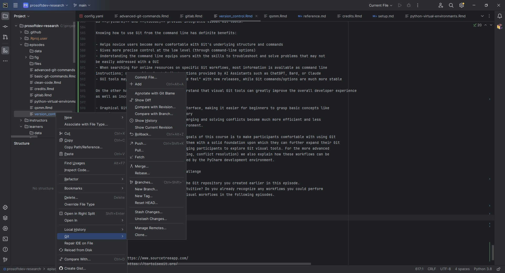

::::::::::::::::::::::::::::::::::::::: objectives

- Understand the benefits of an automated version control system.
- Understand the basics of how automated version control systems work.
- Configure `git` the first time it is used on a computer.
- Understand the meaning of the `--global` configuration flag.
- Create a local Git repository.
- Describe the purpose of the `.git` directory.

::::::::::::::::::::::::::::::::::::::::::::::::::

:::::::::::::::::::::::::::::::::::::::: questions

- What is version control and why should I use it?
- How do I get set up to use Git?
- Where does Git store information?

::::::::::::::::::::::::::::::::::::::::::::::::::


## Motivation

Jimmy and Alfredo have been hired by Ratatouille restaurant (a special restaurant from Euphoric State University) to
investigate if it is possible to make the best recipes archive ever. Before even starting, they make a plan of how they
want to accomplish this task, and come up with the following requirements:

- The want to be able to work on recipes at the same time, with minimal coordination, and make sure they do not
overwrite each other's changes.
- The want to be able to look back at the history of a recipe, and see who has added what to that recipe.
- They also would like to be able, at any time, to go back to an older version of any recipe.

A colleague suggests using [version control](learners/reference.md#version-control) to
manage their work. Alfredo and Luigi look at what version control systems are available, and end up choosing `Git`,
since it is widely used - it is pretty much the de-facto standard in this area. Throughout this course we will
follow Luigi and Alfredo on their journey learning and using Git.


## Automatic Version Control

:::::::::::::::::::::::::::::::::::::::::  callout

### What Is Automatic Version Control?

Automatic version control is a system that tracks changes to files over time, allowing multiple people to collaborate,
revert to previous versions, and maintain a history of modifications. It is commonly used in software development to
manage  source code, but it can also be used for documents, configurations, and other digital assets.

::::::::::::::::::::::::::::::::::::::::::::::::::

Using version control has many benefits, the most important being:

- Nothing that is committed to version control is ever lost, unless you work really, really hard at losing it. Since
  all old versions of files are saved, it's always possible to go back in time to see exactly who wrote what on a
  particular day, or what version of a program was used to generate a particular set of results.

- As we have this record of who made what changes when, we know who to ask if we have questions later on, and, if
  needed, revert to a previous version, much like the "undo" feature in an editor.

- When several people collaborate in the same project, it's possible to accidentally overlook or overwrite someone's
  changes. The version control system automatically notifies users whenever there's a conflict between one
  person's work and another's.

Teams are not the only ones to benefit from version control: lone researchers can benefit immensely. Keeping a record
of what was changed, when, and why is extremely useful for all researchers if they ever need to come back to the project
later on (e.g., a year later, when memory has faded).

Version control is the lab notebook of the digital world: it's what professionals use to keep track of what they've done
and to collaborate with other people.  Every large software development project relies on it, and most programmers use
it for their small jobs as well.  And it isn't just for software: books, papers, small data sets, and anything that
changes over time or needs to be shared can and should be stored in a version control system.

We'll start by exploring how version control can be used to keep track of what one person did and when.
Even if you aren't collaborating with other people, automated version control is much better than this situation:

{alt='Comic: a PhD student sends "FINAL.doc" to their supervisor, but after several increasingly intense and frustrating rounds of comments and revisions they end up with a file named "FINAL_rev.22.comments49.corrections.10.#@$%WHYDIDCOMETOGRADSCHOOL????.doc"'}

We've all been in this situation before: it seems unnecessary to have
multiple nearly-identical versions of the same document. Some word
processors let us deal with this a little better, such as Microsoft
Word's
[Track Changes](https://support.office.com/en-us/article/Track-changes-in-Word-197ba630-0f5f-4a8e-9a77-3712475e806a),
Google Docs' [version history](https://support.google.com/docs/answer/190843?hl=en), or
LibreOffice's [Recording and Displaying Changes](https://help.libreoffice.org/Common/Recording_and_Displaying_Changes).

Version control systems start with a base version of the document and then record changes you make each step of the way.
You can think of it as a recording of your progress: you can rewind to start at the base document and play back each
change you made, eventually arriving at your more recent version.

{alt='A diagram demonstrating how a single document grows as the result of sequential changes'}

Once you think of changes as separate from the document itself, you
can then think about "playing back" different sets of changes on the base document, ultimately
resulting in different versions of that document. For example, two users can make independent
sets of changes on the same document.

{alt='A diagram with one source document that has been modified in two different ways to produce two different versions of the document'}

Unless multiple users make changes to the same section of the document - a 
[conflict](../learners/reference.md#conflict) - you can
incorporate two sets of changes into the same base document.

{alt='A diagram that shows the merging of two different document versions into one document that contains all of the changes from both versions'}

It is the version control system that keeps track of these changes for us, by effectively creating different versions of
our files. It allows us to decide which changes will be made to the next version (each record of these changes is
called a [commit](../learners/reference.md#commit)), and keeps useful metadata about them. The complete history of
commits for a particular project and their metadata make up a [repository](../learners/reference.md#repository).
Repositories can be kept in sync across different computers, facilitating collaboration among different people.

:::::::::::::::::::::::::::::::::::::::::  callout

### The Long History of Version Control Systems

Automated version control systems are nothing new.
Tools like [RCS](https://en.wikipedia.org/wiki/Revision_Control_System), [CVS](https://en.wikipedia.org/wiki/Concurrent_Versions_System), or [Subversion](https://en.wikipedia.org/wiki/Apache_Subversion) have been around since the early 1980s and are used by
many large companies.
However, many of these are now considered legacy systems (i.e., outdated) due to various
limitations in their capabilities.
More modern systems, such as Git and [Mercurial](https://swcarpentry.github.io/hg-novice/),
are *distributed*, meaning that they do not need a centralized server to host the repository.
These modern systems also include powerful merging tools that make it possible for
multiple authors to work on the same files concurrently.


::::::::::::::::::::::::::::::::::::::::::::::::::

:::::::::::::::::::::::::::::::::::::::  challenge

### Paper Writing

- Imagine you drafted an excellent paragraph for a paper you are writing, but later ruin
  it. How would you retrieve the *excellent* version of your conclusion? Is it even possible?

- Imagine you have 5 co-authors. How would you manage the changes and comments
  they make to your paper?  If you use LibreOffice Writer or Microsoft Word, what happens if
  you accept changes made using the `Track Changes` option? Do you have a
  history of those changes?

:::::::::::::::  solution

### Solution

- Recovering the excellent version is only possible if you created a copy of the old version of the paper.
  The danger of losing good versions often leads to the problematic workflow illustrated in the PhD Comics
  cartoon at the top of this page.

- Collaborative writing with traditional word processors is cumbersome. Either every collaborator has to work on a
  document sequentially (slowing down the process of writing), or you have to send out a version to all collaborators
  and manually merge their comments into your document. The 'track changes' or 'record changes' option can
  highlight changes for you and simplifies merging, but as soon as you accept changes you will lose their history.
  You will then no longer know who suggested that change, why it was suggested, or when it was
  merged into the rest of the document. Even online word processors like
  Google Docs or Microsoft Office Online do not fully resolve these problems.
  
  

:::::::::::::::::::::::::

::::::::::::::::::::::::::::::::::::::::::::::::::

:::::::::::::::::::::::::::::::::::::::: keypoints

- Version control is like an unlimited 'undo'.
- Version control also allows many people to work in parallel.

::::::::::::::::::::::::::::::::::::::::::::::::::


## Introducing Git

In this section we will move away from the general discussion on version control systems, and focus on
one modern such system - namely *Git* - which over the past ten years has emerged as the de-facto standard in this
area. One of the main goals of this course is to make you very comfortable with using git, which we believe will
greatly help you towards the goal of making robust and reproducible research software. If you want to know more
about how *git* has emerged as the dominant version control system, there are a few interesting articles on
its history [here](https://www.geeksforgeeks.org/history-of-git/),
[here](https://www.welcometothejungle.com/en/articles/btc-history-git), and
[here](https://en.wikipedia.org/wiki/Git)


### Setting Up Git

::::::::::::::::::::::::::::::::::::::::::  prereq

### Prerequisites

- In this episode we use Git from the Unix Shell. Some previous experience with the shell is expected,
*but isn't mandatory*.
- It is also assumed that you have already installed *Git* on your system. If this is not the case, please do
this now, by following the download/installation instructions [here](https://git-scm.com/)

::::::::::::::::::::::::::::::::::::::::::::::::::


When we use Git on a new computer for the first time, we need to configure a few things. Below are a few examples
of configurations we will set as we get started with Git:

- our name and email address,
- what our preferred text editor is,
- and that we want to use these settings globally (i.e. for every project).

On a command line, Git commands are written as `git verb options`,
where `verb` is what we actually want to do and `options` is additional optional information which may be needed for the `verb`.
So here is how Alfredo sets up *git* on his new laptop:

```bash
$ git config --global user.name "Alfredo Linguini"
$ git config --global user.email "a.linguini@ratatouille.fr"
```

Please use your own name and email address instead of Alfredo's. This user name and email will be associated with your subsequent Git activity,
which means that any changes pushed to Git platforms, such as
[GitHub](https://github.com/),
[BitBucket](https://bitbucket.org/),
[GitLab](https://gitlab.com/) or
any other Git host server after this lesson will include this information.

For this lesson, we will be interacting with TU Delft [GitLab instance] and so the email address
used should be your TUD email.


:::::::::::::::::::::::::::::::::::::::::  callout

### Line Endings

As with other keys, when you press <kbd>Enter</kbd> or <kbd>↵</kbd> or on Macs, <kbd>Return</kbd> on your keyboard,
your computer encodes this input as a character. Different operating systems use different character(s) to represent
the end of a line. (You may also hear these referred to as newlines or line breaks.) Because Git uses these characters
to compare files, it may cause unexpected issues when editing a file on different machines.
Though it is beyond the scope of this lesson, you can read more about this issue
[in the Pro Git book](https://www.git-scm.com/book/en/v2/Customizing-Git-Git-Configuration#_core_autocrlf).

You can change the way Git recognizes and encodes line endings
using the `core.autocrlf` command to `git config`. The following settings are recommended:

On macOS and Linux:

```bash
$ git config --global core.autocrlf input
```

And on Windows:

```bash
$ git config --global core.autocrlf true
```

::::::::::::::::::::::::::::::::::::::::::::::::::

Alfredo also has to set his favorite text editor, following this table:

| Editor                                | Configuration command | 
| :-----------                          | :------------------------------ |
| Atom                                  | `$ git config --global core.editor "atom --wait"`                      | 
| nano                                  | `$ git config --global core.editor "nano -w"`                      | 
| BBEdit (Mac, with command line tools) | `$ git config --global core.editor "bbedit -w"`                      | 
| Sublime Text (Mac)                    | `$ git config --global core.editor "/Applications/Sublime\ Text.app/Contents/SharedSupport/bin/subl -n -w"`                      | 
| Sublime Text (Win, 32-bit install)    | `$ git config --global core.editor "'c:/program files (x86)/sublime text 3/sublime_text.exe' -w"`                      | 
| Sublime Text (Win, 64-bit install)    | `$ git config --global core.editor "'c:/program files/sublime text 3/sublime_text.exe' -w"`                      | 
| Notepad (Win)                         | `$ git config --global core.editor "c:/Windows/System32/notepad.exe"`                      | 
| Notepad++ (Win, 32-bit install)       | `$ git config --global core.editor "'c:/program files (x86)/Notepad++/notepad++.exe' -multiInst -notabbar -nosession -noPlugin"`                      | 
| Notepad++ (Win, 64-bit install)       | `$ git config --global core.editor "'c:/program files/Notepad++/notepad++.exe' -multiInst -notabbar -nosession -noPlugin"`                      | 
| Kate (Linux)                          | `$ git config --global core.editor "kate"`                      | 
| Gedit (Linux)                         | `$ git config --global core.editor "gedit --wait --new-window"`                      | 
| Scratch (Linux)                       | `$ git config --global core.editor "scratch-text-editor"`                      | 
| Emacs                                 | `$ git config --global core.editor "emacs"`                      | 
| Vim                                   | `$ git config --global core.editor "vim"`                      | 
| VS Code                               | `$ git config --global core.editor "code --wait"`                      | 

It is possible to reconfigure the text editor for Git whenever you want to change it. To keep the presentation uniform,
we will use `nano` as our default editor for this workshop.

Git (2.28+) allows configuration of the name of the branch created when you initialize any new repository.  Alfredo
decides to use that feature to set it to `main` so it matches the cloud service he will eventually use.

```bash
$ git config --global init.defaultBranch main
```

:::::::::::::::::::::::::::::::::::::::::  callout

### Default Git branch naming

Source file changes are associated with a "branch." For new learners in this lesson, it's enough to know that branches
exist, and this lesson uses one branch. By default, Git will create a branch called `master` when you create a new
repository with `git init` (as explained in the next section). This term evokes
the racist practice of human slavery and the
[software development community](https://github.com/github/renaming) has moved to adopt
more inclusive language.

In 2020, most Git code hosting services transitioned to using `main` as the default branch. As an example, any new
repository that is opened in GitHub and GitLab default to `main`. However, Git has not yet made the same change.
As a result, local repositories must be manually configured have the same main branch name as most cloud services.

For versions of Git prior to 2.28, the change can be made on an individual repository level.  The
command for this is in the next episode.  Note that if this value is unset in your local Git
configuration, the `init.defaultBranch` value defaults to `master`.

::::::::::::::::::::::::::::::::::::::::::::::::::

The five commands we just ran above only need to be run once: the flag `--global` tells Git
to use the settings for every project, in your user account, on this computer.

Let's review those settings with the `list` command:

```bash
$ git config --list
```

If necessary, you change your configuration using the same commands to choose another editor or update your email
address. This can be done as many times as you want.

:::::::::::::::::::::::::::::::::::::::::  callout

### Proxy

In some networks you need to use a [proxy](https://en.wikipedia.org/wiki/Proxy_server). If this is the case, you
may also need to tell Git about the proxy:

```bash
$ git config --global http.proxy proxy-url
$ git config --global https.proxy proxy-url
```

To disable the proxy, use

```bash
$ git config --global --unset http.proxy
$ git config --global --unset https.proxy
```

::::::::::::::::::::::::::::::::::::::::::::::::::

:::::::::::::::::::::::::::::::::::::::::  callout

### Git Help and Manual

Always remember that if you forget the subcommands or options of a `git` command, you can access the
relevant list of options typing `git <command> -h` or access the corresponding Git manual by typing
`git <command> --help`, e.g.:

```bash
$ git config -h
$ git config --help
```

While viewing the manual, remember the `:` is a prompt waiting for commands and you can press <kbd>Q</kbd> to exit the manual.

More generally, you can get the list of available `git` commands and further resources of the Git manual typing:

```bash
$ git help
```

::::::::::::::::::::::::::::::::::::::::::::::::::


:::::::::::::::::::::::::::::::::::::::: keypoints

- Use `git config` with the `--global` option to configure a user name, email address, editor, and other preferences once per machine.

::::::::::::::::::::::::::::::::::::::::::::::::::

## Creating a Git Repository

Once Git is configured, we can start using it.

We will help Alfredo with his new project, create a repository with all his recipes.

First, let's create a new directory in the `Desktop` folder for our work and then change the current working directory to the newly created one:

```bash
$ cd ~/Desktop
$ mkdir recipes
$ cd recipes
```

Then we tell Git to make `recipes` a [repository](../learners/reference.md#repository)
\-- a place where Git can store versions of our files:

```bash
$ git init
```

It is important to note that `git init` will create a repository that can include subdirectories and their
files---there is no need to create separate repositories nested within the `recipes` repository, whether
subdirectories are present from the beginning or added later. Also, note that the creation of the `recipes` directory
and its initialization as a repository are completely separate processes.

It is also important to understand that the Git repositories that you will create and use in this episode and the next
one are all `local` - meaning they only exists on your computer, and can only be used by you. In the next workshop we
will show you how to transition from a local repository to an online one - which will enable you to collaborate
with multiple colleagues working on the same project.

If we use `ls` to show the directory's contents, it appears that nothing has changed:

```bash
$ ls
```

But if we add the `-a` flag to show everything,
we can see that Git has created a hidden directory within `recipes` called `.git`:

```bash
$ ls -a
```

```output
.	..	.git
```

Git uses this special subdirectory to store all the information about the project, including the tracked files and
sub-directories located within the project's directory. If we ever delete the `.git` subdirectory,
we will lose the project's version control history.

We can now start using one of the most important git commands, which is particularly helpful to beginners. `git status` tells us the status of our project, and better,
a list of changes in the project and options on what to do with those changes. We can use it as often as we want, whenever we want to understand what is going on.

```bash
$ git status
```

```output
On branch main

No commits yet

nothing to commit (create/copy files and use "git add" to track)
```

If you are using a different version of `git`, the exact wording of the output might be slightly different.

:::::::::::::::::::::::::::::::::::::::  challenge

### Places to Create Git Repositories

Along with tracking information about recipes (the project we have already created), Alfredo would also like to track
information about desserts specifically. Alfredo creates a `desserts` project inside his `recipes`
project with the following sequence of commands:

```bash
$ cd ~/Desktop    # return to Desktop directory
$ cd recipes      # go into recipes directory, which is already a Git repository
$ ls -a           # ensure the .git subdirectory is still present in the recipes directory
$ mkdir desserts # make a sub-directory recipes/desserts
$ cd desserts    # go into desserts subdirectory
$ git init        # make the desserts subdirectory a Git repository
$ ls -a           # ensure the .git subdirectory is present indicating we have created a new Git repository
```

Is the `git init` command, run inside the `desserts` subdirectory, required for
tracking files stored in the `desserts` subdirectory?

:::::::::::::::  solution

### Solution

No. Alfredo does not need to make the `desserts` subdirectory a Git repository because the `recipes` repository will
track all files, sub-directories, and subdirectory files under the `recipes` directory.  Thus, in order to track
all information about desserts, Alfredo only needed to add the `desserts` subdirectory to the `recipes` directory.

Additionally, Git repositories can interfere with each other if they are "nested": the outer repository will try
to version-control the inner repository. Therefore, it's best to create each new Git repository in a separate directory.
To be sure that there is no conflicting repository in the directory, check the output of `git status`. If it looks
like the following, you are good to go to create a new repository as shown above:

```bash
$ git status
```

```output
fatal: Not a git repository (or any of the parent directories): .git
```

:::::::::::::::::::::::::

### Correcting `git init` Mistakes

Jimmy explains to Alfredo how a nested repository is redundant and may cause confusion down the road. Alfredo would
like to go back to a single git repository. How can Alfredo undo his last `git init` in the `desserts` subdirectory?

:::::::::::::::  solution

### Solution -- USE WITH CAUTION!

### Background

Removing files from a Git repository needs to be done with caution. But we have not learned
yet how to tell Git to track a particular file; we will learn this in the next episode. Files
that are not tracked by Git can easily be removed like any other "ordinary" files with

```bash
$ rm filename
```

Similarly a directory can be removed using `rm -r dirname`. If the files or folder being removed in this fashion are
tracked by Git, then their removal becomes another change that we will need to track, as we will see in the next episode.

### Solution

Git keeps all of its files in the `.git` directory. To recover from this little mistake, Alfredo can remove the `.git`
folder in the desserts subdirectory by running the following command from inside the `recipes` directory:

```bash
$ rm -rf desserts/.git
```

But be careful! Running this command in the wrong directory will remove the entire Git history of a project you might
want to keep. In general, deleting files and directories using `rm` from the command line cannot be reversed.
Therefore, always check your current directory using the command `pwd`.


:::::::::::::::::::::::::

::::::::::::::::::::::::::::::::::::::::::::::::::

:::::::::::::::::::::::::::::::::::::::: keypoints

- `git init` initializes a repository.
- Git stores all of its repository data in the `.git` directory.

::::::::::::::::::::::::::::::::::::::::::::::::::


## Command Line or Graphical Tools?

It is possible to use Git from either the command line (e.g. `GitBash`) or through a variety of visual tools, such as
**[Sourcetree]**, **[TortoiseGit]**, **[SmartGit]**. Furthermore, most modern integrated development environments such
as **[PyCharm]** and **[VSCode]** provide integrated visual Git tools.

Knowing how to use Git from the command line has definite benefits:

- Helps novice users become more comfortable with Git's underlying structure and commands
- Gives more precise control at the low level (through command-line options)
- Equips users with the skills to troubleshoot and solve problems that may not be easily addressed with a GUI
- When searching for online resources on specific Git workflows, most information is available as command line
instructions; same applies for help/instructions provided by AI Assistants such as ChatGPT, Gemini, or Claude
- GUI tools may change their menus/"look and feel" with new releases, while Git commands/options are much more stable

On the other hands, it is important to understand that visual Git tools can greatly improve the overall developer
experience as well as increase productivity:

- Graphical Git tools offer an intuitive interface, making it easier for beginners to grasp basic concepts like
branching, or viewing the repository's history
- Certain advanced Git workflows, such as merging and solving conflicts become much more efficient and less
error-prone when performed in a visual environment.

Given all these considerations, one of the goals of this course is to make participants comfortable with using Git
from the command line, in order to provide them with a solid foundation upon which they can further expand their Git
knowledge. At the same time, we are encouraging participants to explore Git visual tools. For the more advanced
Git workflows (e.g. reviewing changes, merging, conflict resolution) we also explain how these workflows can be
performed using the Git visual tools provided by the PyCharm development environment.

:::::::::::::::::::::::::::::::::::::::  challenge

Using PyCharm, open the folder containing the Git repository you created earlier in this episode.
Locate the Git visual controls. Are they intuitive? Do you already recognize any workflows you could perform
from Pycharm? We will cover some of these visual workflows in the following episodes.

:::::::::::::::  solution

Accessing the Git visual tools in PyCharm is done by right-clicking on a file/folder in the left navigation panel,
then selecting `Git` from the pop-up menu.

{alt='Accessing Git visual tools in PyCharm'}

:::::::::::::::

::::::::::::::::::::::::::::::::::::::::::::::::::


:::::::::::::::::::::::::::::::::::::::: keypoints

- Use git from the command line for maximum control over workflows.
- Using visual tools for some of the advanced Git workflows will increase productivity and reduce errors.

::::::::::::::::::::::::::::::::::::::::::::::::::


[Sourcetree]: https://www.sourcetreeapp.com/
[TortoiseGit]: https://tortoisegit.org/
[SmartGit]: https://www.syntevo.com/smartgit/
[PyCharm]: https://www.jetbrains.com/pycharm/
[VSCode]: https://code.visualstudio.com/
[GitLab instance]: https://gitlab.tudelft.nl/


