:::::::::::::::::::::::::::::::::::::: questions 

- What is GitLab?
- How can I find my way around GitLab?
- How can I create, modify and archive a GitLab project?
- How can multiple people collaborate on a project?

::::::::::::::::::::::::::::::::::::::::::::::::

::::::::::::::::::::::::::::::::::::: objectives

- Use GitLab’s interface to find a project.
- Use GitLab’s interface to find groups.
- Create a project.
- Change name, description, visibility, and avatar of a project.
- Archive (or delete) a project.
- Explain the concepts of members and roles.
- Add a member to a project.
- Contribute to a project that you are a member of.

::::::::::::::::::::::::::::::::::::::::::::::::

## Introduction

[GitLab] is a web application for managing [Git] repositories.
Since it is build around Git, it is suitable to manage any project that works primarily with
plain text files, for example software source code, TeX based documents, or meeting notes in Markdown.
With its built-in issue and wiki systems, it can, in certain cases, even be the right tool for managing
a project without any files.

This episode will give you a foundational understanding of GitLab’s features, so you can make
informed decisions on how to use it as a tool.

TU Delft is running their own self-hosted [GitLab instance]. As a QuTech employee, you
are entitled to use this TUD GitLab instance; you can login to it with your NetID:

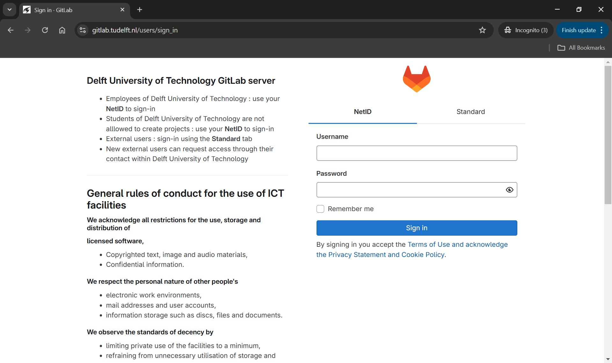{alt='TUD GitLab Login Page'}

[Git]: https://git-scm.com/
[GitLab]: https://about.gitlab.com/
[GitLab instance]: https://gitlab.tudelft.nl/


## Navigation

When we log into GitLab for the first time, we are greeted by a welcome page:

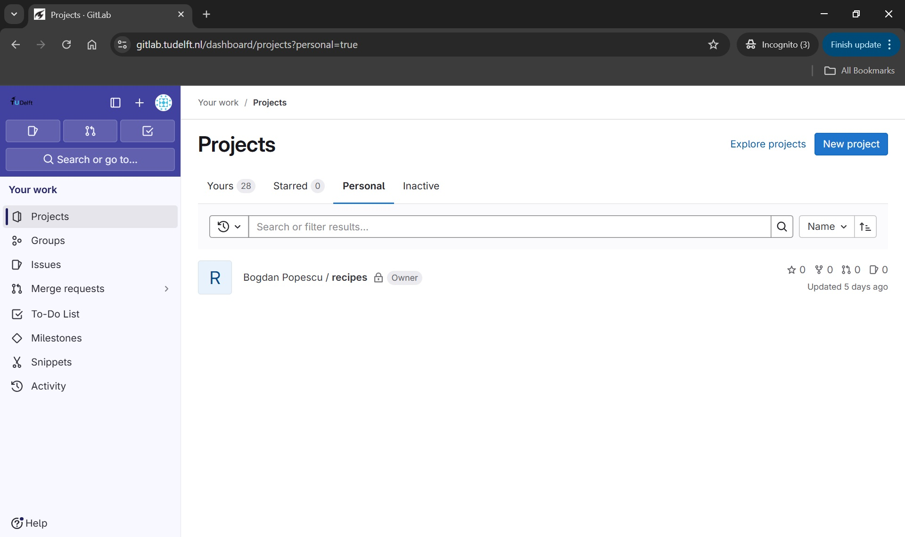{alt='TUD GitLab Login Page'}

The “Explore projects” page looks like this:

{alt="Explore projects page with tab “Most starred” open.
The tab shows a list of projects with icon, name, descriptions, and four statistical values for each entry."}

The first tab, “All”, lists all projects that  are visible to you in most recently updated order.

The second tab, “Most starred projects”, also lists all projects, but this time ordered most
starred first. Users of a GitLab instance can “star” a project, which is the equivalent of
bookmarking them, as we will see shortly.

The third tab, “Trending”, lists all projects again, but this time ordered by activity during
the previous months.

You can use the filter field next to the tab names to search through all projects that
are visible to you.

In the next section we will explain how you can create new GitLab projects

## GitLab Projects

### Creating a Project

After knowing how to find groups and projects, we want to go from passively
browsing GitLab to actively using it. We are going to create a project and
connect a local Git repository to it.

To create a project, we click on the "New project" button on the upper-right corner of the right tab.

Multiple options are presented for how to create the new project. In this lesson
we will only look at, and use, the first option: “Create blank project”. So
click on that.

This leads to the following page:

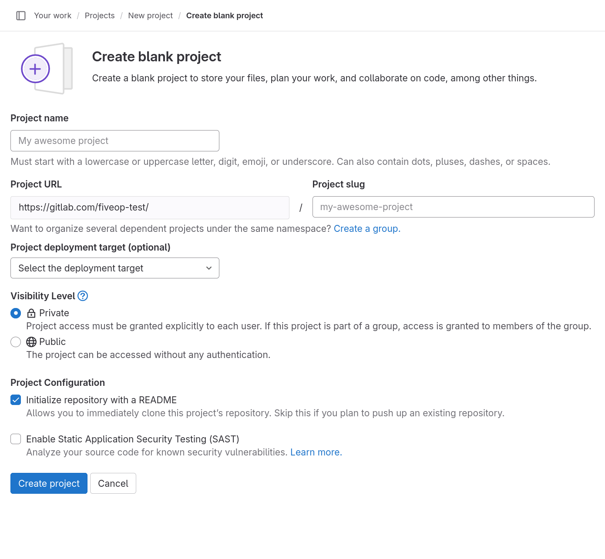{alt='Create blank project form'}

The “Project name” field is for just that, the project name. Its value has no
other purpose and can be changed at anytime without indirect consequences (the
direct consequence being, that its name will be different). Following the example in the previous episodes,
we will call it “recipes”.

As we fill in the project name, a project slug gets suggested in the respective
field. The project slug is the last part of the project’s, and the associated
Git repository’s, URL or web address.

If the user belongs to at least one group, the URL’s middle part can be chosen in the drop-down
field labeled “Project URL”, which defaults to the current user’s username.
The default, indicated by the user’s name, is the location for a user’s projects (and groups).
Other options in the drop-down list are the groups in which the current user may create projects.

::: callout

##### Project URL and Project Slug

The two fields under labels “Project URL” and “Project slug” are the only fields in this form for
which changing the value later might cause problems. They determine the URL under which the project’s
pages and the project’s Git repository can be found, so changing them later might brake links and
bookmarks as well as connections from Git repositories on other systems, for example on
contributors’ machines.

:::

We ignore the field labeled “Project deployment target (optional)”.

The choice under label “Visibility Level” determines the project’s visibility.

::: callout

##### Visiblity

GitLab offers three settings for the visibility of a project: public, internal, and private.
Publicly visible projects can be looked at by anyone that can access the GitLab instance, projects
with internal visibility can be looked at by anyone logged in to the instance, while projects with
private visibility can only be looked at by its members.

On GitLab.com the visibility “internal” is disabled. Everyone can create an
account, log in to the instance, and thus could look at any project of
internal visibility anyway.

Self-hosted instances might also disable some visibility types. For example,
the public visibility might be disabled, to prevent users from publishing
something to the whole internet.

:::

We choose “Private” for our project’s visibility.

If, as per default, the checkbox “Initialize repository with a README” is checked, the project’s
repository will be initialized with a commit that adds a file called `README.md`.
Otherwise, a the project will start with an empty repository.
We will add such a file later ourselves, so we uncheck the box.

::: callout

##### README

A project’s README file usually contains basic information about the project: what it contains,
how it can be used (for example built or installed, if it is a software project), how to contribute,
how to get help, and licensing information.

It is common to write README files in Markdown format, indicated by the
filename suffix `.md`.

Platforms like GitLab show the contents of a project’s README file on its
homepage; if it is in Markdown format, in its rendered form.

:::

We will ignore any other fields that may be visible depending on the GitLab
instances configuration.

After clicking the “Create project” button, GitLab creates the project and
redirects us to the project’s homepage, which looks similar to this:

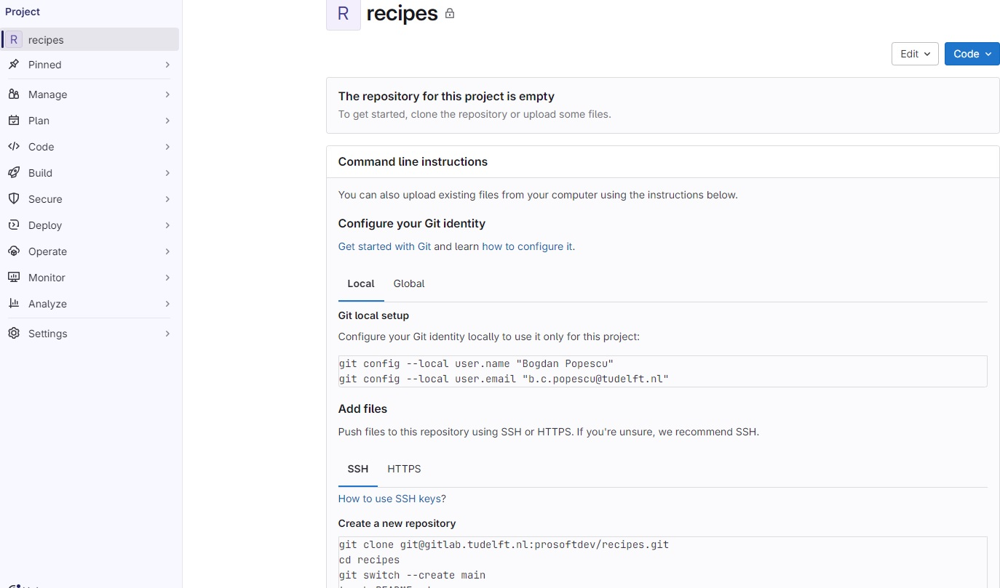{alt='Project homepage for a new project'}

The page is split into the menu on the left and the project overview on the
right.

The menu leads to pages related to various properties, processes, and content of
the project. It is visible on each of these pages. The number of menu entries
may seem overwhelming, in particular when one notices that the entries have
sub-entries. However, it is not necessary to know what hides behind all these
entries to use GitLab. Following this lesson, we will get to know parts of what
lies behind the entries “Manage”, “Plan”, "Code", “Build”, and “Settings”.

The project overview shows (from the top): The project’s avatar (or icon) and name;
a prompt to invite team members (we will cover members later on);
a statement that our repository is currently empty with buttons for
several options to add content to it; and finally the beginning of the
instructions on how to push a local repository to this project’s repository to
fill it with content. We will follow them in just a bit.

The project overview page will look slightly different, once we have content in
its repository. We will have another look at the page then.

::: challenge

##### Change Name, Description, Visibility, or Avatar

Click on the “Settings” sub-menu and select its “General” entry.
Set the description to something meaningful, such as “A collection of simple recipes”.

The project description appears in many lists and on some pages under the
project’s name.

Then change any of the project’s name, visibility, or avatar.
Do not forget to click the “Save changes” button once you are done.

This exercise should take about 5 minutes.

:::

::: callout

##### Markdown

Markdown is a markup language like HTML, on which the World Wide Web is based, or wikitext,
which is used to write Wikipedia’s content.
Its markup directives, indicating
for example that something is a headline or a list item, are such that they
serve their purpose even in the plain text form.

:::

The project overview page presents us with many options to add content to the project’s repository
directly in GitLab. We will add our first file to the project repository in the next section.

&nbsp;

### Archiving a Project

We just went through the beginning of a GitLab project’s life cycle.
At its end, if it has one, a project gets archived (or deleted).
We will now go through the process of archiving a project, without completing the procedure.

Using the menu on the left, we navigate to the project’s “General” settings.

At the bottom of the page, we find a section named “Advanced”.
We click on the “Expand” button right next to it and scroll down the page.

Notice that some of buttons here are not the usual blue or white, but rather red.
This indicates that we should be careful about clicking them.
Things might break or get deleted.

Scrolling back up, we find a section labeled “Archive Project”. Clicking the
button will not delete the project. Instead it will be placed in a read-only
mode. Everything will be preserved but nothing can be changed anymore. In
addition, the project no longer shows up in search results and on the page for
exploring projects.

Most of the time archiving a project is preferable to deleting it, in particular
when it comes to research projects. **Do not archive the project now! We will
work with it throughout this lesson.**

At the bottom of the page is also a section for deleting a project, in case you
ever think that is the right thing to do.


## Connecting GitLab Projects with Local Git Repositories

Remember from an earlier lesson that we have created a local Git repository
that looked like this:

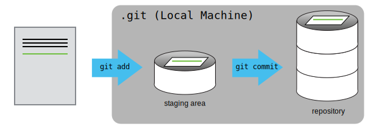{alt='Local repository with staging area'}

Now we want to have a GitLab project that will be coupled with this local Git repo.
The first step here is to follow the steps described in the previous section,
and create a new GitLab project called 'recipes'. Initially the Git repo for
this GitLab project will be empty, as shown in the diagram below:

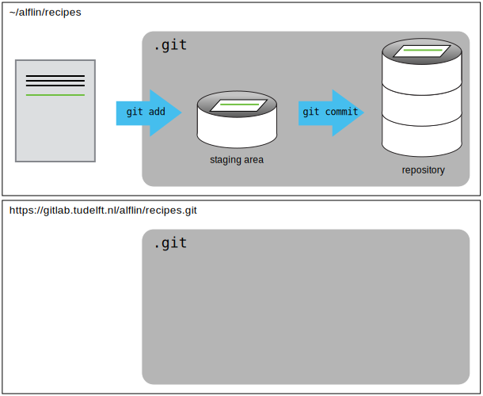{alt='The local and remote Git repos'}

&nbsp;

### Connecting the local to remote repository

Now we connect the two repositories.  We do this by making the
GitLab repository a [remote](../learners/reference.md#remote) for the local repository.
Go to the home page of the repository on GitLab, click on the blue `Code` button,
and copy the string below the `Clone with SSH`

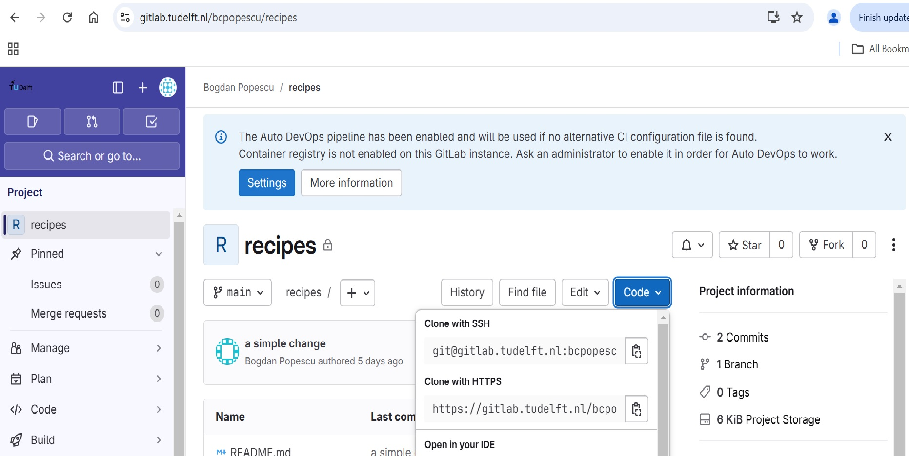{alt='Accessing a GitLab repo via SSH'}

:::::::::::::::::::::::::::::::::::::::::  callout

##### HTTPS vs. SSH

We use SSH here because, while it requires some additional configuration, it is a
security protocol widely used by many applications.  The steps below describe SSH at a
minimum level for GitLab.


::::::::::::::::::::::::::::::::::::::::::::::::::

With the `Clone with SSH` string you copied from the GitLab page, go into the local
`recipes` repository, and run this command:

```bash
$ git remote add origin git@gitlab.tudelft.nl:alflin/recipes.git
```

Make sure to use the URL for your repository rather than Alfredo's: the only
difference should be your username instead of `alflin`.

`origin` is a local name used to refer to the remote repository. It could be called
anything, but `origin` is a convention that is often used by default in git
and GitLab, so it's helpful to stick with this unless there's a reason not to.

We can check that the command has worked by running `git remote -v`:

```bash
$ git remote -v
```

```output
origin   git@gitlab.tudelft.nl:alflin/recipes.git (fetch)
origin   git@gitlab.tudelft.nl:alflin/recipes.git (push)
```

&nbsp;

### SSH Background and Setup

Before Alfredo can connect to a remote repository, he needs to set up a way for his computer
to authenticate with GitLab so it knows it's him trying to connect to his remote repository.

We are going to set up the method that is commonly used by many different services to authenticate
access on the command line. This method is called Secure Shell Protocol (SSH). SSH is a cryptographic
network protocol that allows secure communication between computers using an otherwise insecure
network.

SSH uses what is called a key pair. This is two keys that work together to validate access. One key
is publicly known and called the public key, and the other key called the private key is kept private.
Very descriptive names.

You can think of the public key as a padlock, and only you have the key (the private key) to open it.
You use the public key where you want a secure method of communication, such as your GitLab account.
You give this padlock, or public key, to GitLab and say "lock the communications to my account with
this so that only computers that have my private key can unlock communications and send git commands
as my GitLab account."

What we will do now is the minimum required to set up the SSH keys and add the public key to a GitLab
account.

The first thing we are going to do is check if this has already been done on the computer you're on.
Because generally speaking, this setup only needs to happen once and then you can forget about it.

:::::::::::::::::::::::::::::::::::::::::  callout

##### Keeping your keys secure

You shouldn't really forget about your SSH keys, since they keep your account secure. It's good
practice to audit your secure shell keys every so often. Especially if you are using multiple
computers to access your account.


::::::::::::::::::::::::::::::::::::::::::::::::::

We will run the list command to check what key pairs already exist on your computer.

```bash
$ ls -al ~/.ssh
```

Your output is going to look a little different depending on whether or not SSH has ever been
set up on the computer you are using.

Alfredo has not set up SSH on his computer, so his output is

```output
ls: cannot access '/c/Users/Alfredo/.ssh': No such file or directory
```

If SSH has been set up on the computer you're using, the public and private key pairs will be listed.
The file names are either `id_ed25519`/`id_ed25519.pub` or `id_rsa`/`id_rsa.pub` depending on how the
key pairs were set up. Since they don't exist on Alfredo's computer, he uses this command to create them.

##### Create an SSH key pair

To create an SSH key pair Alfredo uses this command, where the `-t` option specifies which type of
algorithm to use and `-C` attaches a comment to the key (here, Alfredo's email):

```bash
$ ssh-keygen -t ed25519 -C "a.linguini@ratatouille.fr"
```

If you are using a legacy system that doesn't support the Ed25519 algorithm, use:
`$ ssh-keygen -t rsa -b 4096 -C "your_email@example.com"`

```output
Generating public/private ed25519 key pair.
Enter file in which to save the key (/c/Users/Alfredo/.ssh/id_ed25519):
```

We want to use the default file, so just press <kbd>Enter</kbd>.

```output
Created directory '/c/Users/Alfredo/.ssh'.
Enter passphrase (empty for no passphrase):
```

Now, it is prompting Alfredo for a passphrase. Since he is using his kitchen's laptop that other
people sometimes have access to, he wants to create a passphrase. Be sure to use something memorable
or save your passphrase somewhere, as there is no "reset my password" option.
Note that, when typing a passphrase on a terminal, there won't be any visual feedback of your typing.
This is normal: your passphrase will be recorded even if you see nothing changing on your screen.

```output
Enter same passphrase again:
```

After entering the same passphrase a second time, we receive the confirmation

```output
Your identification has been saved in /c/Users/Alfredo/.ssh/id_ed25519
Your public key has been saved in /c/Users/Alfredo/.ssh/id_ed25519.pub
The key fingerprint is:
SHA256:SMSPIStNyA00KPxuYu94KpZgRAYjgt9g4BA4kFy3g1o a.linguini@ratatouille.fr
The key's randomart image is:
+--[ED25519 256]--+
|^B== o.          |
|%*=.*.+          |
|+=.E =.+         |
| .=.+.o..        |
|....  . S        |
|.+ o             |
|+ =              |
|.o.o             |
|oo+.             |
+----[SHA256]-----+
```

The "identification" is actually the private key. You should never share it. The public key is
appropriately named.  The "key fingerprint" is a shorter version of a public key.

Now that we have generated the SSH keys, we will find the SSH files when we check.

```bash
ls -al ~/.ssh
```

```output
drwxr-xr-x 1 Alfredo   197121   0 Jul 16 14:48 ./
drwxr-xr-x 1 Alfredo   197121   0 Jul 16 14:48 ../
-rw-r--r-- 1 Alfredo   197121 419 Jul 16 14:48 id_ed25519
-rw-r--r-- 1 Alfredo   197121 106 Jul 16 14:48 id_ed25519.pub
```

&nbsp;

### Copy the public key to GitLab

Now we have a SSH key pair and we can run this command to check if GitLab can read our authentication.

```bash
ssh -T git@gitlab.tudelft.nl
```

```output
The authenticity of host 'gitlab.tudelft.nl (192.30.255.112)' can't be established.
RSA key fingerprint is SHA256:nThbg6kXUpJWGl7E1IGOCspRomTxdCARLviKw6E5SY8.
This key is not known by any other names
Are you sure you want to continue connecting (yes/no/[fingerprint])? y
Please type 'yes', 'no' or the fingerprint: yes
Warning: Permanently added 'gitlab.tudelft.nl' (RSA) to the list of known hosts.
git@gitlab.tudelft.nl: Permission denied (publickey).
```

Right, we forgot that we need to give GitLab our public key!

First, we need to copy the public key.  Be sure to include the `.pub` at the end,
otherwise you're looking at the private key.

```bash
cat ~/.ssh/id_ed25519.pub
```

```output
ssh-ed25519 AAAAC3NzaC1lZDI1NTE5AAAAIDmRA3d51X0uu9wXek559gfn6UFNF69yZjChyBIU2qKI a.linguini@ratatouille.fr
```

Now, going to the GitLab page in your browser, click on your profile icon in the top right corner
of the left panel, then click on the `SSH Keys` link under `User Settings` in the same panel:

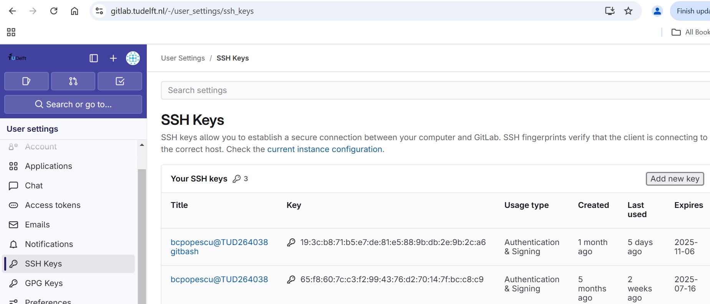{alt='The SSH Keys page in GitLab'}

Click on the `Add new key` button, which will take you to a page like this:

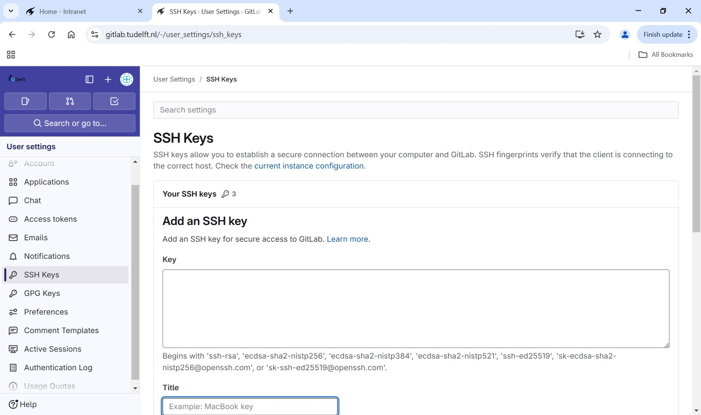{alt='Adding a new key in GitLab'}

Here, you can paste your public key in the `Key` box, add a title, and set an expiration
date. Once everything is filled in, you can click the `Add key` button.

Now that we've set that up, let's check our authentication again from the command line.

```bash
$ ssh -T git@gitlab.tudelft.nl
```

```output
Welcome to GitLab, @alflin!
```

Good! This output confirms that the SSH key works as intended. We are now ready to push our
work to the remote repository.

&nbsp;

### Push local changes to a remote

Now that authentication is setup, we can return to the remote.  This command will push the changes from
our local repository to the repository on GitLab:

```bash
$ git push origin main
```

Since Alfredo set up a passphrase, it will prompt him for it. If you completed advanced settings
for your authentication, it will not prompt for a passphrase.

```output
Enumerating objects: 16, done.
Counting objects: 100% (16/16), done.
Delta compression using up to 8 threads.
Compressing objects: 100% (11/11), done.
Writing objects: 100% (16/16), 1.45 KiB | 372.00 KiB/s, done.
Total 16 (delta 2), reused 0 (delta 0)
remote: Resolving deltas: 100% (2/2), done.
To https://gitlab.tudelft.nl/alflin/recipes.git
 * [new branch]      main -> main
```

:::::::::::::::::::::::::::::::::::::::::  callout


## Password Managers

If your operating system has a password manager configured, `git push` will
try to use it when it needs your username and password.  For example, this
is the default behavior for Git Bash on Windows. If you want to type your
username and password at the terminal instead of using a password manager,
type:

```bash
$ unset SSH_ASKPASS
```

in the terminal, before you run `git push`.  Despite the name, [Git uses
`SSH_ASKPASS` for all credential
entry](https://git-scm.com/docs/gitcredentials#_requesting_credentials), so
you may want to unset `SSH_ASKPASS` whether you are using Git via SSH or
https.

You may also want to add `unset SSH_ASKPASS` at the end of your `~/.bashrc`
to make Git default to using the terminal for usernames and passwords.


::::::::::::::::::::::::::::::::::::::::::::::::::

Our local and remote repositories are now in this state:

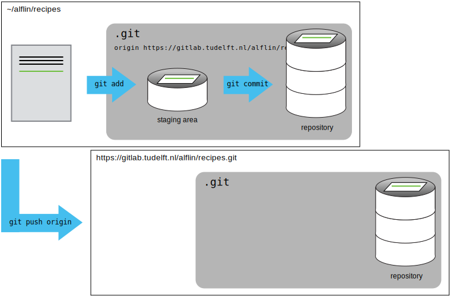{alt='GitLab repo after first push'}

We can pull changes from the remote repository to the local one as well:

```bash
$ git pull origin main
```

```output
From https://gitlab.tudelft.nl/alflin/recipes
 * branch            main     -> FETCH_HEAD
Already up-to-date.
```

Pulling has no effect in this case because the two repositories are already
synchronized.  If someone else had pushed some changes to the repository on
GitLab, though, this command would download them to our local repository.


## Adding Project Members

So far, each of you has created a GitLab project that no one but you can
contribute to; depending on the visibility setting, no one but you might be able
to even see it.

Git and GitLab can be and is used for one-person projects. But we want our
colleagues to contribute to our recipes collection. To achieve this, we will grant others access
to our GitLab project.

Using the menu on the left side of the project homepage (or nearly any other
project page), we navigate to the project members page hovering over or clicking
on "Manage" and then clicking on "Members" in the submenu. The
project member page should look similar to the following screenshot:

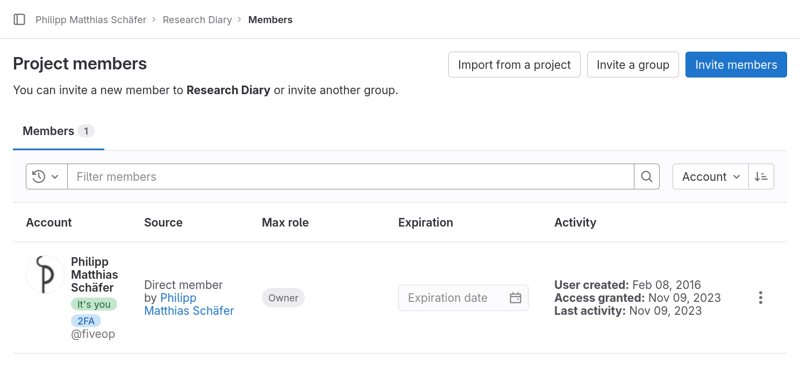{alt='Project Members page'}

On the page we can see the page title, "Project members", three buttons to the
left of the title, and a filterable table of members, currently only listing
ourselves.

The table shows our full name and account name, why we are a member of this project,
what our maximum role is–more on that in a bit–, when we got access—at the moment we
created the project—, a disabled membership expiration date widget, and three dates on
our activity.

For practice we will all add an instructor to our project and remove them again
right away. Click the button labeled "Invite members", type in the username your
instructors provided you with into the search field, make sure that "Guest" is
selected as a role, and click the button labeled "Invite".

Your instructor should now be listed next to you in the table.
Unlike in your row, you can change the role and the expiration date of this new entry.

The role determines what the member is allowed to do in the project.
An owner has full rights, a guest almost none.
GitLab’s handbook gives a detailed [overview](https://docs.gitlab.com/ee/user/permissions.html) of
the different roles’ permissions.

Now, we are going to remove the instructor from your project’s members again.
Click the three dots on the right in the instructor’s row, then click on "Remove member", and
finally click the button of the same name in the popup dialog.
The page reloads itself and the entry vanishes from the table.


::: challenge

##### Adding Members

Get into pairs and add each other with the role "Maintainer" to your projects.

The "Maintainer" role grants just enough permissions for all the collaborative
tasks we will practice in this lesson.

This exercise should take about 5 minutes.

:::


&nbsp;
&nbsp;
&nbsp;

::::::::::::::::::::::::::::::::::::: keypoints 

- Projects are GitLab’s primary entity of organization.
- You can explore/search projects visible to you on the “Explore projects” page.
- Groups can contain projects and other groups.
- You can explore/search groups visible to you on the ”Explore groups” page.
- Creating a GitLab project requires not more than a few clicks and providing a name.
- A project’s visibility can be set to either private, internal, or public.
- Adding others as members allows them to directly contribute to your projects
- Members with sufficient rights can independently contribute to repositories

::::::::::::::::::::::::::::::::::::::::::::::::

